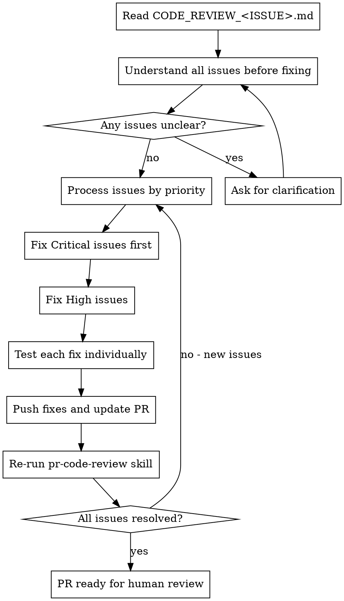

# Addressing Code Review

Fix issues identified in code review before proceeding to merge.

**Core principle:** Verify before implementing. Technical correctness over speed.

## When to Use

- `CODE_REVIEW_*.md` file exists with Critical or High issues
- After `project:pr-code-review` finds issues to address

## The Process



## How to Address Issues

**1. Read the CODE_REVIEW file:**

```bash
ls CODE_REVIEW_*.md
```

**2. Understand ALL issues before fixing.** Items may be related. If unclear, ask first.

**3. Process by priority:**

| Priority | Action                                                     |
| -------- | ---------------------------------------------------------- |
| Critical | Must fix immediately - security, trading safety, data loss |
| High     | Should fix before merge - missing tests, architecture      |
| Medium   | Fix if trivial, otherwise document for later               |
| Low      | Optional - style, minor optimizations                      |

**4. For each issue:** Read suggestion -> Verify in code -> Apply fix -> Test -> Commit

**5. Test each fix:**

```bash
uv run pytest tests/test_<relevant>.py -v
```

**6. Commit and re-run review:**

```bash
git commit -m "fix(scope): address review feedback for #ISSUE"
git push
# Then use project:pr-code-review skill again
```

## Handling Feedback

**When correct:** Just fix it. Actions speak.

```
Fix: "Fixed. Added null check at trader.py:42"
Don't: "You're absolutely right!" / "Great point!"
```

**When wrong:** Push back with technical reasoning.

```
"Checked - this legacy path is needed for backward compat.
Should we drop pre-v1 support instead?"
```

**Push back when:** Breaks functionality, lacks context, violates YAGNI, conflicts with AGENTS.md

## Trading Logic Fixes

**Extra scrutiny for:**

- Entry/exit condition changes
- Position sizing modifications
- Stop loss calculations
- Risk limit adjustments

**Always verify:**

- Tests exist for the trading scenario
- Alpaca API is mocked in tests
- No real trades possible in test mode

## Red Flags

**Never:**

- Start fixing before understanding all issues
- Fix out of order (Critical must be first)
- Skip testing individual fixes
- Merge with unfixed Critical issues
- Implement unclear feedback without asking
- Skip trading logic tests for execution changes

## Quick Reference

| Step           | Action                                       |
| -------------- | -------------------------------------------- |
| Find review    | `ls CODE_REVIEW_*.md`                        |
| Priority order | Critical -> High -> Medium -> Low            |
| Test each fix  | `uv run pytest tests/<specific-file>.py -v`  |
| Commit         | `fix(scope): address review feedback for #N` |
| Re-verify      | Use `project:pr-code-review` skill again     |
