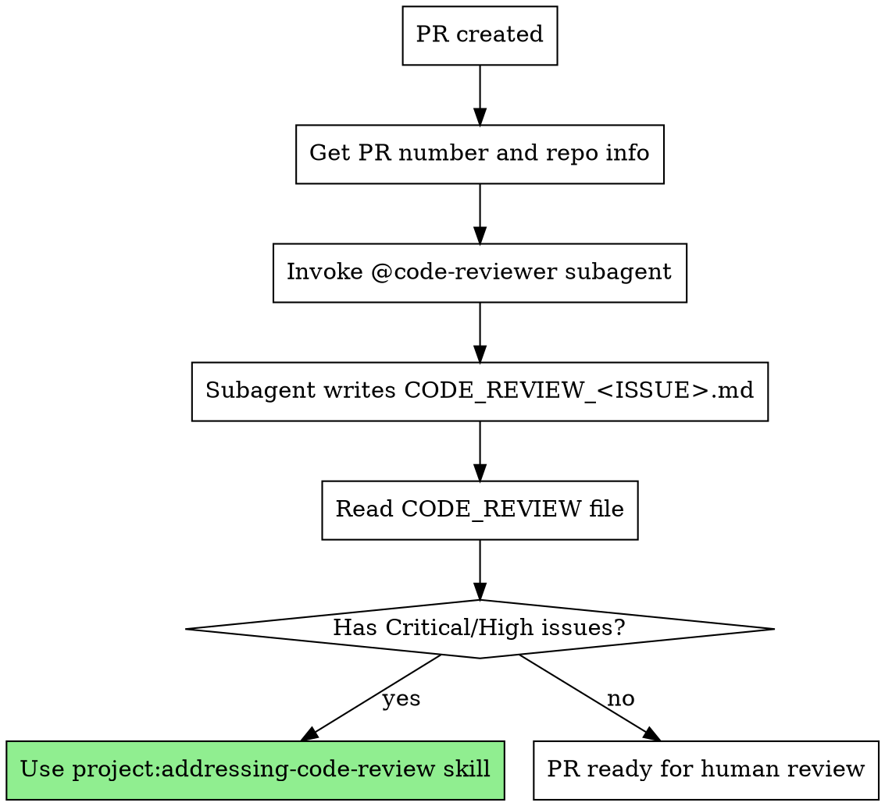

# PR Code Review

Invoke `@code-reviewer` subagent after PR creation to catch issues early.

**Core principle:** Review before merging, fix before proceeding.

## When to Use

**Automatic triggers:**

- After creating a PR (mandatory)
- After completing major feature implementation
- Before merging to main

**Manual triggers:**

- When stuck (fresh perspective)
- After fixing complex bug

## The Process



## How to Request Review

**1. Get required information:**

Get repo owner/name from git remote:

```bash
git remote get-url origin
# Parse: git@github.com:OWNER/REPO.git
```

Get issue number from branch name:

```bash
git branch --show-current  # e.g., feature/issue-42-description
```

Get PR number from GitHub MCP or after PR creation.

**2. Invoke the code-reviewer subagent:**

```
@code-reviewer Please review:
- ISSUE_NUMBER: 42
- PR_NUMBER: 91
- OWNER: kimrejstrom
- REPO: alpacalyzer-algo-trader
- FEATURE_DESCRIPTION: Added momentum strategy implementation
```

**3. Wait for CODE_REVIEW file:**

Subagent will create `CODE_REVIEW_{ISSUE_NUMBER}.md` in root directory.

**4. Handle feedback:**

- **No Critical/High issues**: PR is ready for human review
- **Has Critical/High issues**: Use `project:addressing-code-review` skill

## Output Location

- **Naming**: `CODE_REVIEW_{ISSUE_NUMBER}.md`
- **Location**: Root directory (git-ignored)

## Red Flags

**Never:**

- Skip code review after PR creation
- Merge with unfixed Critical issues
- Ignore High issues without justification
- Skip trading logic review for execution changes

## Quick Reference

| Step          | Command/Action                      |
| ------------- | ----------------------------------- |
| Get repo info | `git remote get-url origin`         |
| Get issue #   | Parse from branch name              |
| Get PR #      | From PR creation or GitHub MCP      |
| Invoke review | `@code-reviewer Please review: ...` |
| Review file   | `CODE_REVIEW_{ISSUE}.md`            |
