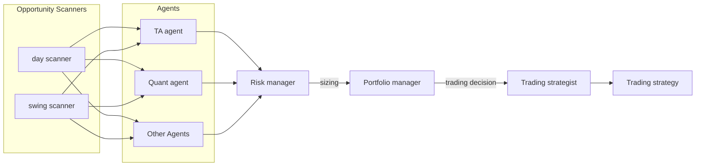
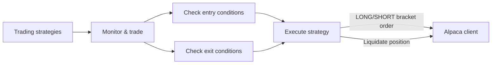

# Alpacalyzer Algo Trader

An algorithmic trading platform that leverages technical analysis, social media sentiment, and AI-powered decision making to execute automated trading strategies through the Alpaca Markets API.

---

## Table of Contents

- [Alpacalyzer Algo Trader](#alpacalyzer-algo-trader)
  - [Table of Contents](#table-of-contents)
  - [Overview](#overview)
  - [Features](#features)
  - [Architecture](#architecture)
    - [Analyze Phase](#analyze-phase)
    - [Trade Phase](#trade-phase)
    - [Core Components](#core-components)
  - [Usage](#usage)
  - [Prerequisites](#prerequisites)
  - [Installation](#installation)
  - [What's in the box ?](#whats-in-the-box-)
    - [uv](#uv)
    - [pre-commit](#pre-commit)
    - [ruff](#ruff)
    - [mypy](#mypy)
  - [Testing](#testing)
  - [Docs](#docs)

---

## Overview

Alpacalyzer is an algorithmic, AI powered hedge fund suite, with analytic as well as trading capabilities. It combines multiple data sources to identify trading opportunities:

- **Technical Analysis**: Evaluates price patterns, momentum indicators, and chart formations
- **Social Media Insights**: Analyzes Reddit and other social platforms for trending stocks
- **AI Decision Engine**: Uses a "Hedge Fund Agent" framework to make final trading decisions

The system executes trades automatically with predefined risk management parameters through bracket orders.

---

## Features

- **Multi-source Market Scanning**: Combines technical, social media, and fundamental analysis
- **Hedge Fund Agent Framework**: Uses AI-based decision making to evaluate trading opportunities
- **Automated Trading**: Executes trades based on configurable strategies
- **Technical Analysis**: Calculates various technical indicators to identify entry/exit points
- **Position Management**: Monitors open positions and implements stop loss/take profit rules
- **Bracket Orders**: Uses Alpaca's bracket orders for trade management with predefined exits

---

## Architecture

### Analyze Phase



### Trade Phase



### Core Components

- **Scanners**: Identify potential trading opportunities

  - `FinvizScanner`: Fetches fundamental and technical data
  - `RedditScanner`: Analyzes subreddits and mentions on Reddit
  - `SocialScanner`: Tracks social media sentiment and mentions

- **Analyzers**: Evaluate opportunities using technical analysis

  - `TechnicalAnalyzer`: Calculates indicators like RSI, MACD, moving averages

- **Hedge Fund**: AI-powered decision making system

  - Aggregates inputs from scanners and analyzers
  - Agents evaluate opportunities and provide insights
    - `Ben Graham`: Fundamental analysis
    - `Bill Ackman`: Activist investing
    - `Cathie Wood`: Growth investing
    - `Charlie Munger`: Value investing
    - `Fundamental Analyst`: Fundamental analysis
    - `Quant Analyst`: Quantitative analysis
    - `Sentiment Analyst`: Social media sentiment analysis
    - `Technical Analyst`: Technical analysis
    - `Warren Buffett`: Value investing
  - Risk and portfolio managers assess risk and position sizing
  - Makes final trade decisions with entry/exit strategies

- **Trader**: Orchestrates scanning, analysis, and trade execution

  - Monitors positions and market conditions
  - Places orders with appropriate risk parameters

---

## Usage

Run the main trader with:

```bash
uv run alpacalyzer
```

For analysis mode only (no real trades):

```bash
uv run alpacalyzer --analyze
```

To focus on specific tickers:

```bash
uv run alpacalyzer --analyze --tickers=AAPL,MSFT,GOOG
```

---

## Prerequisites

- [Python](https://www.python.org/downloads/) **>=3.13.0 <3.14.0** (_tested with 3.13.1_)
- [pre-commit](https://pre-commit.com/#install) **>=3.2.0 <5.0.0** (_tested with 4.0.1_)
- [uv](https://docs.astral.sh/uv/getting-started/installation/) **>=0.5.7** (_tested with 0.5.15_)

---

## Installation

1. Clone the git repository

   ```bash
   git clone https://github.com/your-username/alpacalyzer-algo-trader.git
   ```

2. Go into the project directory

   ```bash
   cd alpacalyzer-algo-trader/
   ```

3. Configure Python environment

   ```bash
   uv python install
   uv venv
   source .venv/bin/activate
   ```

4. Install dependencies

   ```bash
   uv pip install -e .
   ```

5. Enable pre-commit hooks

   ```bash
   pre-commit install
   ```

6. Set up environment variables (create .env file with your Alpaca API keys)

   ```env
   ALPACA_API_KEY=your_api_key
   ALPACA_SECRET_KEY=your_secret_key
   ```

---

## What's in the box ?

### uv

[uv](https://github.com/astral-sh/uv) is an extremely fast Python package and project manager, written in Rust.

- `pyproject.toml`: orchestrates your project and its dependencies
- `uv.lock`: ensures package versions are consistent

### pre-commit

[pre-commit](https://pre-commit.com/) is a framework for managing and maintaining multi-language pre-commit hooks.

- `.pre-commit-config.yaml`: defines what hooks run and when

### ruff

[ruff](https://github.com/astral-sh/ruff) is a fast Python linter written in Rust.

- Configured in `pyproject.toml`

### mypy

[mypy](http://mypy-lang.org/) is a static type checker for Python.

- Configured in `pyproject.toml`

---

## Testing

We use [pytest](https://docs.pytest.org/) and [pytest-cov](https://github.com/pytest-dev/pytest-cov) for testing and coverage.

Run tests:

```bash
uv run pytest tests
```

<details>
<summary>Output</summary>

```text
collected 1 item

tests/test_myapplication.py::test_hello_world PASSED
```

</details>

Run tests with coverage:

```bash
uv run pytest tests --cov=src
```

<details>
<summary>Output</summary>

```text
collected 1 item

tests/test_myapplication.py::test_hello_world PASSED

---------- coverage: platform linux, python 3.10.4-final-0 -----------
Name                            Stmts   Miss  Cover
---------------------------------------------------
src/myapplication/__init__.py       1      0   100%
src/myapplication/main.py           6      2    67%
---------------------------------------------------
TOTAL                               7      2    71%
```

</details>

## Docs

[In-depth Guide](docs/index.md)
