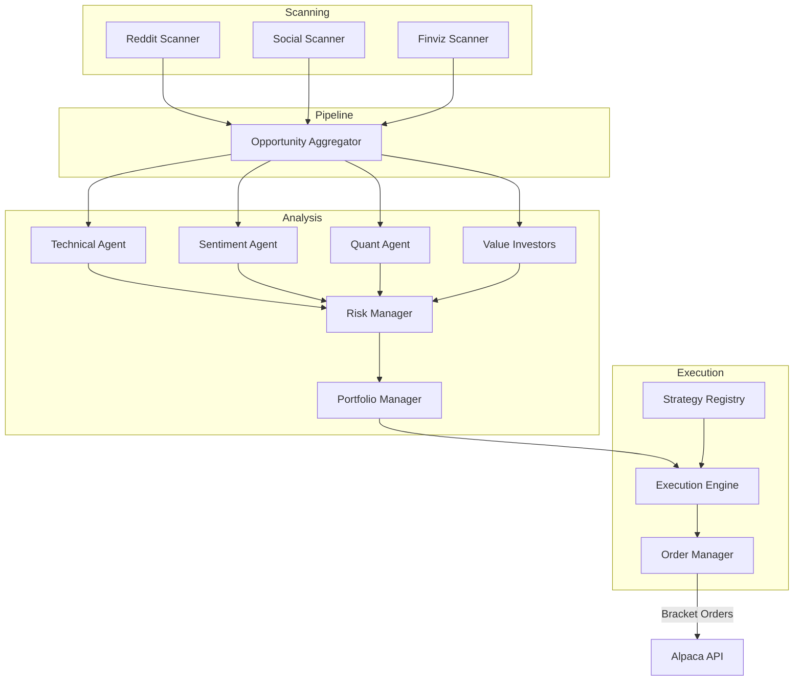

# Alpacalyzer Algo Trader

An AI-powered algorithmic trading platform that combines technical analysis, social media sentiment, and multi-agent decision-making to execute automated trading strategies through the Alpaca Markets API.

---

## Table of Contents

- [Overview](#overview)
- [Features](#features)
- [Architecture](#architecture)
- [Quick Start](#quick-start)
- [Usage](#usage)
- [Development](#development)
- [Testing](#testing)
- [Documentation](#documentation)

---

## Overview

Alpacalyzer is an algorithmic, AI-powered hedge fund suite with analytic and trading capabilities. It combines multiple data sources to identify trading opportunities:

- **Technical Analysis**: Evaluates price patterns, momentum indicators (RSI, MACD), and chart formations via TA-Lib
- **Social Media Insights**: Analyzes Reddit (r/wallstreetbets, r/stocks), Stocktwits, and Finviz for trending stocks
- **AI Decision Engine**: Uses a LangGraph-based "Hedge Fund Agent" framework with GPT-4 for final trading decisions

The system executes trades automatically with predefined risk management parameters through bracket orders.

---

## Features

- **Multi-source Market Scanning**: Combines technical, social media, and fundamental analysis
- **Hedge Fund Agent Framework**: LangGraph workflow with specialized AI agents (value investors, quants, sentiment analysts)
- **Automated Trading**: Executes trades with configurable strategies via Alpaca API
- **Technical Analysis**: TA-Lib powered indicators (RSI, MACD, Bollinger Bands, moving averages)
- **Position Management**: Monitors open positions with stop loss/take profit rules
- **Bracket Orders**: Uses Alpaca's bracket orders for trade management with predefined exits

---

## Architecture

### Pipeline Overview



### Key Components

| Component     | Tech      | Location                                   | Description                  |
| ------------- | --------- | ------------------------------------------ | ---------------------------- |
| CLI Entry     | argparse  | `src/alpacalyzer/cli.py`                   | Command-line interface       |
| Orchestrator  | Python    | `src/alpacalyzer/orchestrator.py`          | Pipeline coordination        |
| Hedge Fund    | LangGraph | `src/alpacalyzer/hedge_fund.py`            | Agent workflow DAG           |
| Agents        | LangGraph | `src/alpacalyzer/agents/`                  | AI decision agents           |
| Strategies    | Protocol  | `src/alpacalyzer/strategies/`              | Pluggable trading strategies |
| Execution     | Python    | `src/alpacalyzer/execution/`               | Trade execution engine       |
| Pipeline      | Python    | `src/alpacalyzer/pipeline/`                | Scanner aggregation          |
| Events        | Pydantic  | `src/alpacalyzer/events/`                  | Structured event logging     |
| Scanners      | Python    | `src/alpacalyzer/scanners/`                | Multi-source scanning        |
| Tech Analysis | TA-Lib    | `src/alpacalyzer/analysis/`                | Technical indicators         |
| Alpaca Client | alpaca-py | `src/alpacalyzer/trading/alpaca_client.py` | Broker API                   |
| Data Models   | Pydantic  | `src/alpacalyzer/data/models.py`           | Type-safe models             |
| GPT           | OpenAI    | `src/alpacalyzer/gpt/call_gpt.py`          | LLM integration              |

### Available Strategies

| Strategy         | Description                           | Config                      |
| ---------------- | ------------------------------------- | --------------------------- |
| `momentum`       | Trend-following with TA confirmation  | Default                     |
| `breakout`       | Price breakout detection              | `--strategy breakout`       |
| `mean_reversion` | Mean reversion on oversold conditions | `--strategy mean_reversion` |

---

## Quick Start

### Prerequisites

- **Python** >=3.13.0 <3.14.0
- **uv** >=0.5.7 ([installation](https://docs.astral.sh/uv/getting-started/installation/))
- **TA-Lib** system library (see below)

### Installation

```bash
# 1. Clone the repository
git clone https://github.com/kimrejstrom/alpacalyzer-algo-trader.git
cd alpacalyzer-algo-trader

# 2. Install TA-Lib system library
# macOS
brew install ta-lib

# Linux (Ubuntu/Debian)
wget https://github.com/ta-lib/ta-lib/releases/download/v0.6.4/ta-lib-0.6.4-src.tar.gz
tar -xzf ta-lib-0.6.4-src.tar.gz
cd ta-lib-0.6.4 && ./configure && make && sudo make install
cd ..

# 3. Install Python dependencies
uv sync

# 4. Setup environment
cp .env.example .env
# Edit .env with your API keys (see below)

# 5. Enable pre-commit hooks
pre-commit install
```

### Environment Variables

Create a `.env` file (see `.env.example`):

```bash
# Alpaca API (paper trading recommended for development)
ALPACA_API_KEY=your_key_here
ALPACA_SECRET_KEY=your_secret_here

# OpenAI API (for GPT-4 agents)
OPENAI_API_KEY=your_key_here

# Optional
LOG_LEVEL=INFO
```

---

## LLM Configuration

Alpacalyzer supports multiple LLM providers via OpenAI-compatible APIs.

### Quick Start (OpenRouter)

1. Get an API key from [OpenRouter](https://openrouter.ai)
2. Set in `.env`:
   ```
   LLM_API_KEY=your_openrouter_key
   ```

### Model Tiers

Different agents use different model tiers based on task complexity:

| Tier     | Agents                             | Default Model     |
| -------- | ---------------------------------- | ----------------- |
| Fast     | Sentiment, Opportunity Finder      | Llama 3.2 3B      |
| Standard | Investor Agents, Portfolio Manager | Claude 3.5 Sonnet |
| Deep     | Quant Agent, Trading Strategist    | Claude 3.5 Sonnet |

Override defaults via environment variables:

```
LLM_MODEL_FAST=meta-llama/llama-3.2-3b-instruct
LLM_MODEL_STANDARD=anthropic/claude-3.5-sonnet
LLM_MODEL_DEEP=anthropic/claude-3.5-sonnet
```

### Rollback to OpenAI

To use the legacy OpenAI implementation:

```
USE_NEW_LLM=false
OPENAI_API_KEY=your_openai_key
```

---

## Usage

### Analysis Mode (No Trades)

```bash
uv run alpacalyzer --analyze
```

### Full Trading Mode

```bash
uv run alpacalyzer
```

### Focus on Specific Tickers

```bash
uv run alpacalyzer --analyze --tickers AAPL,MSFT,GOOG
```

### Select Trading Strategy

```bash
# Use momentum strategy (default)
uv run alpacalyzer --strategy momentum

# Use breakout strategy
uv run alpacalyzer --strategy breakout

# Use mean reversion strategy
uv run alpacalyzer --strategy mean_reversion
```

### Select Agent Mode

```bash
# All agents (default)
uv run alpacalyzer --agents ALL

# Trade-focused agents only
uv run alpacalyzer --agents TRADE

# Investment-focused agents only
uv run alpacalyzer --agents INVEST
```

### End-of-Day Analysis

```bash
# Run EOD performance analyzer
uv run alpacalyzer --eod-analyze

# Analyze specific date
uv run alpacalyzer --eod-analyze --eod-date 2026-01-13
```

### Strategy Performance Dashboard

```bash
# Show dashboard for all strategies
uv run alpacalyzer --dashboard

# Backtest specific ticker
uv run alpacalyzer --dashboard --ticker AAPL --strategy momentum --days 30
```

### CLI Options Reference

| Flag                          | Description                         |
| ----------------------------- | ----------------------------------- |
| `--analyze`                   | Dry run mode (no real trades)       |
| `--tickers AAPL,MSFT`         | Focus on specific tickers           |
| `--strategy NAME`             | Select trading strategy             |
| `--agents ALL\|TRADE\|INVEST` | Select agent mode                   |
| `--stream`                    | Enable websocket streaming          |
| `--ignore-market-status`      | Trade outside market hours          |
| `--eod-analyze`               | Run EOD performance analyzer        |
| `--dashboard`                 | Show strategy performance dashboard |

---

## Development

### Tooling

| Tool                                      | Purpose                   | Config                      |
| ----------------------------------------- | ------------------------- | --------------------------- |
| [uv](https://github.com/astral-sh/uv)     | Package & project manager | `pyproject.toml`, `uv.lock` |
| [pre-commit](https://pre-commit.com/)     | Git hooks                 | `.pre-commit-config.yaml`   |
| [ruff](https://github.com/astral-sh/ruff) | Linting & formatting      | `pyproject.toml`            |
| [ty](https://github.com/astral-sh/ty)     | Type checking             | -                           |
| [pytest](https://docs.pytest.org/)        | Testing                   | `pyproject.toml`            |

### Commands

```bash
# Lint
uv run ruff check .

# Format
uv run ruff format .

# Type check
uv run ty check src

# Run all checks
uv run ruff check . && uv run ruff format . && uv run ty check src
```

### For AI Agents

See [AGENTS.md](AGENTS.md) for comprehensive development guidelines including:

- Test-driven development workflow
- Skill files for common tasks (`.claude/skills/`)
- Code review instructions
- Worktree management for parallel development

---

## Testing

```bash
# Run all tests
uv run pytest tests

# Run with coverage
uv run pytest tests --cov=src

# Run specific test file
uv run pytest tests/test_technical_analysis.py -v
```

### Key Testing Patterns

- **OpenAI mocking**: Automatic via `conftest.py` fixture
- **Alpaca API mocking**: Use `monkeypatch` for trading logic tests
- **No real API calls**: All external APIs must be mocked in tests

---

## Documentation

- [AGENTS.md](AGENTS.md) - AI agent development guidelines
- [migration_roadmap.md](migration_roadmap.md) - Architecture refactoring roadmap (Phase 6 in progress)
- [docs/](docs/index.md) - In-depth technical documentation

### Migration Status

The codebase has completed a strategic migration from a monolithic `Trader` class to a modular architecture:

| Phase     | Status      | Description                                                           |
| --------- | ----------- | --------------------------------------------------------------------- |
| Phase 1-5 | ✅ Complete | Strategy abstraction, execution engine, events, pipeline, backtesting |
| Phase 6   | ✅ Complete | Clean break - removed `trader.py`, full `ExecutionEngine` integration |

See [migration_roadmap.md](migration_roadmap.md) for details and completed [issues #60-#66](https://github.com/kimrejstrom/alpacalyzer-algo-trader/issues).

---

## License

MIT License - see [LICENSE](LICENSE)
