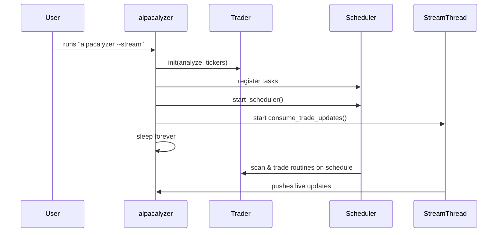

# Chapter 1: CLI & Scheduling

Welcome to the first chapter! Here we’ll learn how the **alpacalyzer** command-line tool sets up our trading bot, accepts simple flags, and uses a background scheduler to run tasks like clockwork—no manual button-pushing needed.

## Why CLI & Scheduling?

Imagine you want your trading bot to:

1. Scan for new opportunities every few minutes.
2. Execute trades automatically.
3. Keep running 24/7 without you sitting at the keyboard.

A **CLI** (Command-Line Interface) gives you a simple front door:

```bash
alpacalyzer --stream --tickers AAPL,MSFT
```

A **scheduler** handles the reminders, like setting alarms on your phone to run tasks on time.

---

## Key Concepts

1. **CLI Flags**

   - `--stream`: turns on live price updates.
   - `--analyze`: dry-run mode (no real trades).
   - `--tickers`: analyze only these symbols.

2. **Trader Initialization**
   Pass flags into a `Trader` object that holds your settings.

3. **Task Scheduling**
   We use the `schedule` library to run:

   - **Insight scans** every 4 hours
   - **Technical scans** every 4 minutes
   - **Hedge-fund routine** every 5 minutes
   - **Monitoring** every 2 minutes (if trading is enabled)

4. **Background Scheduler**
   A small thread that wakes up, checks if any task is due, and runs it.

---

## Using the CLI: A Simple Walkthrough

1. **Parse flags**

   ```python
   parser = argparse.ArgumentParser()
   parser.add_argument("--stream", action="store_true")
   parser.add_argument("--analyze", action="store_true")
   parser.add_argument("--tickers", type=str)
   args = parser.parse_args()
   ```

   This reads what you typed and sets `args.stream`, `args.analyze`, etc.

2. **Initialize the Trader**

   ```python
   from alpacalyzer.trading.trader import Trader

   trader = Trader(analyze_mode=args.analyze,
                   direct_tickers=args.tickers.split(",") if args.tickers else [])
   ```

   Now `trader` knows your preferences.

3. **Schedule tasks**

   ```python
   import schedule

   # Run insight scan now and every 4 hours
   schedule.every(4).hours.do(trader.scan_for_insight_opportunities)
   # Run hedge fund loop at once and every 5 minutes
   schedule.every(5).minutes.do(trader.run_hedge_fund)
   ```

   Each `do()` call registers a reminder.

4. **Start the scheduler thread**

   ```python
   from alpacalyzer.utils.scheduler import start_scheduler

   start_scheduler()
   ```

   This launches a background thread that ticks every second and runs due tasks.

5. **(Optional) Start streaming**

   ```python
   if args.stream:
       import threading
       from alpacalyzer.trading.alpaca_client import consume_trade_updates

       threading.Thread(target=consume_trade_updates, daemon=True).start()
   ```

   Your bot now also listens to real-time market data.

---

## What Happens Under the Hood?

Here’s a simple sequence of events when you run `alpacalyzer --stream`:



1. **CLI** reads your flags and creates the **Trader**.
2. It registers jobs with **schedule**.
3. `start_scheduler()` spins up a thread running `schedule.run_pending()` every second.
4. If you passed `--stream`, another thread connects for live updates.
5. The main thread just idles (sleep), keeping the process alive.

---

## Peek into the Code

### `safe_execute` (src/alpacalyzer/cli.py)

```python
def safe_execute(fn):
    try:
        fn()
    except Exception:
        logger.error("Error, retry in 30s")
        time.sleep(30)
        fn()
```

Wraps each task so a failure doesn’t crash the whole bot—just retries after 30 seconds.

### Scheduler Starter (src/alpacalyzer/utils/scheduler.py)

```python
def run_scheduler():
    while True:
        schedule.run_pending()
        time.sleep(1)

def start_scheduler():
    threading.Thread(target=run_scheduler, daemon=True).start()
```

Like hiring a personal assistant who checks your to-do list every second and runs anything due.

---

## Conclusion

You’ve learned how to:

- Use a friendly CLI to control your bot.
- Schedule periodic tasks with `schedule`.
- Keep everything running smoothly in background threads.

Next up, we’ll see how the **Trader** orchestrates these scans and turns them into trades:
[Chapter 2: Trading Orchestrator (Trader)](02_trading_orchestrator__trader__.md)

---

Generated by [AI Codebase Knowledge Builder](https://github.com/The-Pocket/Tutorial-Codebase-Knowledge)
