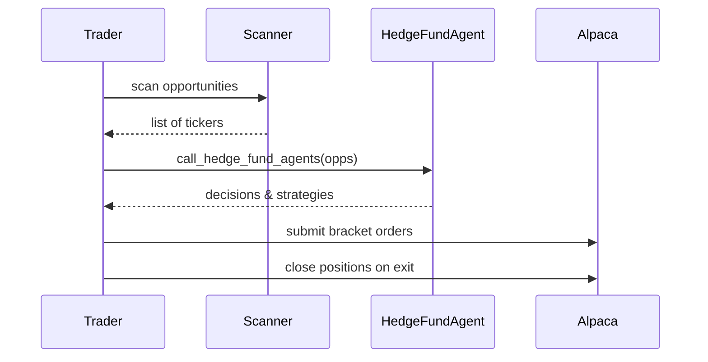

# Chapter 2: Trading Orchestrator (Trader)

Welcome back! In [Chapter 1: CLI & Scheduling](01_cli___scheduling_.md) we learned how to start our bot and schedule tasks. Now we’ll meet the **Trader**—the “chef” in our trading kitchen.

## Why a Trading Orchestrator?

Imagine you’re running a restaurant:

1. **Scan the pantry** for fresh ingredients (market scans).
2. **Consult the recipe** to decide what to cook (hedge-fund logic).
3. **Send orders** to the kitchen (place trades).
4. **Taste and adjust** while cooking (monitor positions & exit).

The `Trader` class does all four steps automatically so you don’t have to press buttons all day.

## Key Concepts

1. **Opportunity Scans**

   - `scan_for_insight_opportunities`: hunts Reddit & Finviz for “hot” tickers.
   - `scan_for_technical_opportunities`: checks social momentum & technical indicators.

2. **Hedge‐Fund Workflow**

   - `run_hedge_fund`: sends opportunities to our “brain” agents ([Chapter 3](03_hedge_fund_workflow_graph_.md)).
   - Collects back **strategies** (entry, stop loss, take profit).

3. **Order Execution**

   - `monitor_and_trade`: watches strategies and submits **bracket orders** via Alpaca when conditions are met.

4. **Position Monitoring & Exit Rules**
   - The same `monitor_and_trade` loop also inspects open positions and closes them on stop-loss, momentum reversals, or weak technicals.

---

## How to Use the Trader

1. Initialize with your CLI flags:

   ```python
   from alpacalyzer.trading.trader import Trader

   # analyze_mode=True → dry-run (no real orders)
   trader = Trader(analyze_mode=True, direct_tickers=['AAPL','MSFT'])
   ```

   Now `trader` has empty lists for `opportunities` and `latest_strategies`.

2. Schedule its methods (see [Chapter 1](01_cli___scheduling_.md)):

   ```python
   import schedule

   schedule.every(5).minutes.do(trader.scan_for_insight_opportunities)
   schedule.every(5).minutes.do(trader.run_hedge_fund)
   schedule.every(2).minutes.do(trader.monitor_and_trade)
   ```

   The scheduler wakes up, calls each method when due, and logs progress:

   ```
   === Insight Scanner Starting - Market Status: open ===
   Added AAPL to opportunities
   === Hedge Fund Starting - Market Status: open ===
   Decisions: buy AAPL long
   === Trading Monitor Loop Starting - Market Status: open ===
   Submitting bracket order for AAPL: BUY 10 @150
   ```

---

## What Happens Under the Hood?



1. **Scans** fill `trader.opportunities`.
2. `run_hedge_fund()` sends them to `call_hedge_fund_agents`.
3. We get back trading **strategies**, stored in `trader.latest_strategies`.
4. `monitor_and_trade()` checks each strategy’s entry criteria; if met, submits a bracket order.
5. It also loops through open **positions**, applies exit rules, and closes them via Alpaca.

---

## Core Code Walkthrough

#### 1. Initialization (src/alpacalyzer/trading/trader.py)

```python
class Trader:
    def __init__(self, analyze_mode=False, direct_tickers=None):
        self.analyze_mode = analyze_mode
        self.direct_tickers = direct_tickers or []
        self.opportunities = []        # gathered tickers
        self.latest_strategies = []    # decisions to execute
```

Sets flags and prepares empty lists.

#### 2. Hedge-Fund Runner

```python
def run_hedge_fund(self):
    if not self.opportunities:
        logger.info("No opportunities.")
        return
    resp = call_hedge_fund_agents(self.opportunities)
    for decision in resp["decisions"].values():
        self.latest_strategies.append(decision)
    self.opportunities.clear()
```

- Skips if no opps.
- Sends opps to agents, collects decisions.
- Clears old opps so we don’t reuse them.

#### 3. Monitor & Trade

```python
def monitor_and_trade(self):
    # ENTRY LOOP
    for strat in list(self.latest_strategies):
        if check_entry_conditions(strat):
            order = create_bracket_order(strat)
            trading_client.submit_order(order)
            self.latest_strategies.remove(strat)
    # EXIT LOOP
    for pos in get_positions():
        if check_exit_conditions(pos):
            trading_client.close_position(pos.symbol)
```

- **Entry**: if criteria met, send bracket order, remove strategy.
- **Exit**: if stop-loss or reversal, close the position.

---

## Conclusion

You now know how the **Trader** ties scans, hedge-fund logic, order execution, and position monitoring into one smooth workflow.

Up next: dive deeper into the decision-making “brain” in [Chapter 3: Hedge-Fund Workflow Graph](03_hedge_fund_workflow_graph_.md).

Happy trading!

---

Generated by [AI Codebase Knowledge Builder](https://github.com/The-Pocket/Tutorial-Codebase-Knowledge)
