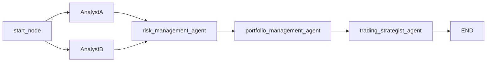
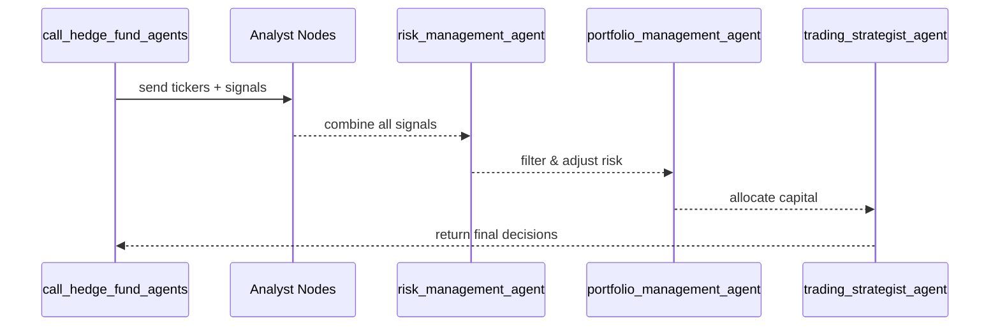

# Chapter 3: Hedge-Fund Workflow Graph

Welcome back! In [Chapter 2: Trading Orchestrator (Trader)](02_trading_orchestrator__trader__.md) we saw how the `Trader` schedules scans and kicks off our hedge-fund routine. Now we’ll build the **road map** that wires together all our “brain” agents into one smooth trading process.

---

## Why a Workflow Graph?

Imagine a factory conveyor belt: raw materials (tickers and signals) arrive at one end and, step by step, get inspected, shaped, packaged, and finally shipped out as finished goods (buy/sell decisions). Our **Hedge-Fund Workflow Graph** does exactly that:

1. Start
2. Multiple **Analyst** stations
3. A **Risk Manager** station
4. A **Portfolio Manager** station
5. A **Trading Strategist** station
6. End

Each station (node) takes in data, does its work, and passes the result to the next. By the end, we have a batch of trading orders ready to go.

---

## Key Concepts

1. **Directed Graph**
   A map of nodes (agents) connected by arrows (edges). Data flows along the arrows.

2. **Nodes**

   - **start_node**: entry point
   - **Analyst Nodes**: each gives its signal on tickers
   - **risk_management_agent**: filters out too-risky ideas
   - **portfolio_management_agent**: decides how much capital to assign
   - **trading_strategist_agent**: crafts final entry/exit rules
   - **END**: marks completion

3. **Edges**
   Arrows that define “who talks to whom.” For example, every analyst feeds into the risk manager.

---

## What the Graph Looks Like



This diagram shows two analysts (`AnalystA`, `AnalystB`) converging into risk, then portfolio, then strategy, and finally the end.

---

## Using the Workflow: A Simple Example

Imagine we have two top tickers from our scans:

```python
from alpacalyzer.hedge_fund import call_hedge_fund_agents
from alpacalyzer.data.models import TopTicker

tickers = [
    TopTicker(ticker="AAPL", recommendation="buy", confidence=0.9),
    TopTicker(ticker="MSFT", recommendation="sell", confidence=0.6),
]

result = call_hedge_fund_agents(tickers)
print(result["decisions"])
```

What happens?

- We call `call_hedge_fund_agents` with our tickers.
- They zip through all the nodes in order.
- We get back a dictionary of final **decisions** like:
  ```json
  {
    "AAPL": { "action": "BUY", "qty": 10, "stop": 148 },
    "MSFT": { "action": "SELL", "qty": 5, "stop": 295 }
  }
  ```

---

## Under the Hood: Step-by-Step

Here’s a high-level flow when `call_hedge_fund_agents` runs:



1. **Caller** invokes the workflow with raw tickers.
2. **Analysts** each add their reasoning.
3. **Risk** filters out ideas that don’t meet risk rules.
4. **Portfolio Mgmt** decides position sizes.
5. **Strategist** crafts the exact orders.
6. Final decisions flow back to the caller.

---

## Peeking at the Code

### 1. Building the Graph

File: `src/alpacalyzer/hedge_fund.py`

```python
from langgraph.graph import StateGraph, END
from alpacalyzer.graph.state import AgentState

def create_workflow():
    graph = StateGraph(AgentState)
    graph.add_node("start_node", start)              # Entry point
    # … add analyst nodes here …
    graph.add_node("risk_management_agent", risk_management_agent)
    graph.add_node("portfolio_management_agent", portfolio_management_agent)
    graph.add_node("trading_strategist_agent", trading_strategist_agent)
    graph.set_entry_point("start_node")
    return graph
```

This sets up an empty graph with our core nodes.

### 2. Adding Analysts Dynamically

```python
from alpacalyzer.agents.agents import get_analyst_nodes

for key, (name, func) in get_analyst_nodes().items():
    graph.add_node(name, func)
    graph.add_edge("start_node", name)
    graph.add_edge(name, "risk_management_agent")
```

We loop through all configured analysts, plug them in, and wire them to the risk manager.

---

## Conclusion

You’ve seen how the **Hedge-Fund Workflow Graph** strings together multiple agents—analysts, risk, portfolio, and strategy—into one clear pipeline. Next up, we’ll zoom in on what each **Analyst Agent** does in detail.

Continue to [Chapter 4: Investment Agents](04_investment_agents_.md) to explore those!

---

Generated by [AI Codebase Knowledge Builder](https://github.com/The-Pocket/Tutorial-Codebase-Knowledge)
