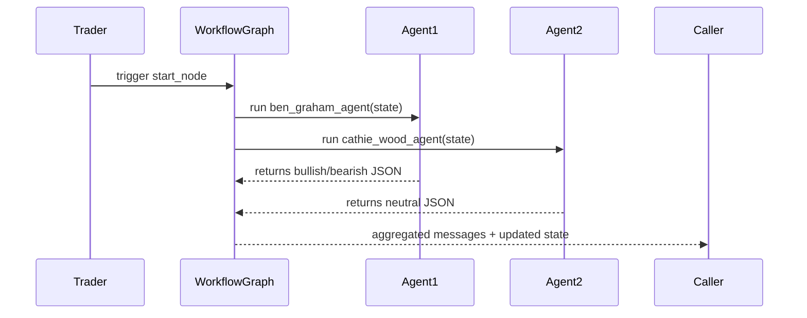

# Chapter 4: Investment Agents

In [Chapter 3: Hedge-Fund Workflow Graph](03_hedge_fund_workflow_graph_.md) we sketched the pipeline from start to finish. Now we’ll zoom in on the **Investment Agents**—the “specialist analysts” who each bring a unique investing philosophy to our fund.

## Why Investment Agents?

Imagine your hedge fund team sitting around a table:

- **Alice** follows Benjamin Graham’s value style.
- **Bob** chases Cathie Wood’s high-growth themes.
- **Carol** reads charts and technical signals.
- **Dave** runs heavy quant models.

Each one reads the same tickers, but filters them through a different lens. Rather than hard-coding one strategy, we build a small piece of code for each philosophy—an **Investment Agent**—that:

1. Fetches or receives tickers.
2. Runs its own sub-analysis (data fetch, scoring).
3. Calls an LLM (or simple logic) to output a JSON signal:
   `{ signal: "bullish"/"neutral"/"bearish", confidence: 0–100, reasoning: "…" }`.

Together, their diverse viewpoints feed into our workflow graph and guide final decisions.

## Key Concepts

1. **ANALYST_CONFIG**
   A simple Python dict listing each agent’s name, display name, function, and order.

2. **get_analyst_nodes()**
   Returns a mapping of `{ key: (node_name, agent_func) }` for dynamic graph wiring.

3. **Agent Function**
   Each `*_agent(state)` takes an `AgentState`, writes its signals into `state["data"]["analyst_signals"]`, and returns messages for the next step.

## Using Investment Agents

Here’s a super-simple way to see them in action:

```python
from alpacalyzer.agents.agents import get_analyst_nodes

# Prepare a fake state with two tickers
state = {
  "data": {"tickers": ["AAPL", "MSFT"], "analyst_signals": {}},
  "metadata": {"show_reasoning": False}
}

for key, (node_name, agent_func) in get_analyst_nodes().items():
    result = agent_func(state)
    # Now state["data"]["analyst_signals"][node_name] holds each ticker's signal
    print(node_name, state["data"]["analyst_signals"][node_name])
```

After running, you’ll see output like:

```
ben_graham_agent  {
  "AAPL": { "signal": "bullish", "confidence": 85, "reasoning": "…" },
  "MSFT": { "signal": "neutral", "confidence": 40, "reasoning": "…" }
}
cathie_wood_agent { … }
quant_agent         { … }
… etc.
```

Each agent recorded its viewpoint. Later, our Risk & Portfolio Managers will filter and size these ideas.

## What Happens Under the Hood?

Below is a simplified sequence when the hedge-fund step runs:



1. **Trader** calls the workflow.
2. **WorkflowGraph** dynamically adds each agent (via `get_analyst_nodes()`) and invokes them.
3. Each **Agent** writes its signals into the shared state.
4. The graph passes all messages downstream to the next node (`risk_management_agent`).

## Under-the-Hood Code Walkthrough

### 1. Configuring Analysts

File: `src/alpacalyzer/agents/agents.py`

```python
ANALYST_CONFIG = {
  "ben_graham":   {"display_name": "Ben Graham",   "agent_func": ben_graham_agent,   "order": 3},
  "cathie_wood":  {"display_name": "Cathie Wood",  "agent_func": cathie_wood_agent,  "order": 5},
  # … other agents …
}

def get_analyst_nodes():
    # Returns { key: (node_name, function) }
    return {
      key: (f"{key}_agent", config["agent_func"])
      for key, config in ANALYST_CONFIG.items()
    }
```

### 2. Wiring into the Workflow

File: `src/alpacalyzer/hedge_fund.py`

```python
from alpacalyzer.agents.agents import get_analyst_nodes

# Inside create_workflow()
for key, (node_name, func) in get_analyst_nodes().items():
    graph.add_node(node_name, func)
    graph.add_edge("start_node", node_name)
    graph.add_edge(node_name, "risk_management_agent")
```

Here we loop through each configured agent, add it as a graph node, and link it between `start_node` and `risk_management_agent`.

## Analogy: A Roundtable Discussion

Think of the workflow graph as a conference table:

1. **start_node**: You hand out the two tickers.
2. Each **Investment Agent** is a specialist at its seat.
3. They pass back a little card: “AAPL is bullish, 80%” (with notes).
4. All cards go to the **Risk Manager** for the next review.

## Conclusion

You’ve learned how **Investment Agents** encapsulate different analysts—value, growth, technical, quant—in tiny, reusable functions. Each one fetches data, runs its logic, and calls an LLM (or simple code) to emit a structured “bullish/neutral/bearish” signal. These diverse viewpoints fuel our hedge-fund pipeline!

Next up, we’ll see how to take these signals and manage risk and portfolio sizing in [Chapter 5: Risk & Portfolio Management Agents](05_risk___portfolio_management_agents_.md).

---

Generated by [AI Codebase Knowledge Builder](https://github.com/The-Pocket/Tutorial-Codebase-Knowledge)
