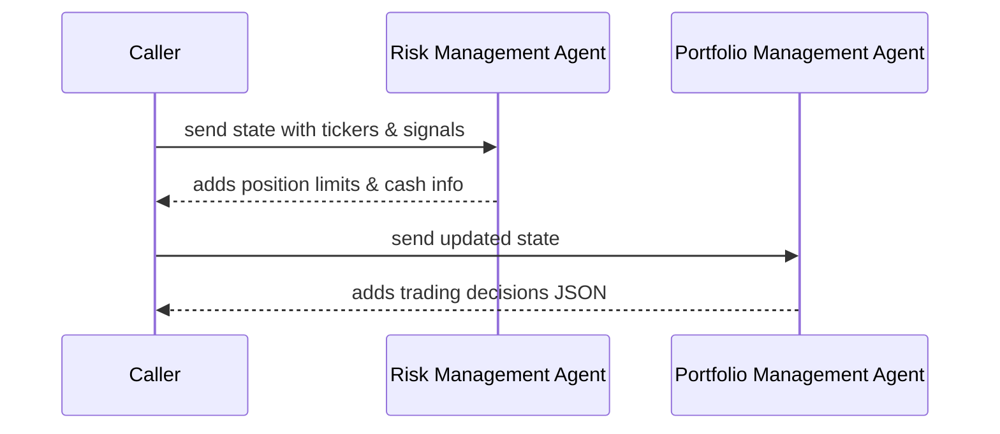

# Chapter 5: Risk & Portfolio Management Agents

In [Chapter 4: Investment Agents](04_investment_agents_.md), we gathered “bullish/neutral/bearish” signals from different analysts. Now it’s time for our **Risk Manager** and **Portfolio Manager** to turn those signals into safe, sized orders.

---

## 5.1 Why Risk & Portfolio Management?

Imagine you and a friend each suggest stocks to buy. Before you dive in:

1. **Risk Manager** says: “Hold on—how much can we safely invest in each without blowing our budget?”
2. **Portfolio Manager** says: “Great, now let’s decide exact buy/sell/short/cover actions given our cash and position limits.”

Together they ensure we don’t over-bet on one ticker and that we have enough cash or margin to act.

---

## 5.2 Key Concepts

1. **Risk Management Agent**

   - Fetches real account data (cash, margin, current positions).
   - Computes per-ticker _remaining position limits_ (e.g. 5% of total equity).
   - Outputs a JSON like:
     ```json
     {
       "AAPL": {
         "remaining_position_limit": 5000,
         "current_price": 150,
         "reasoning": { "portfolio_value": 100000, … }
       }
     }
     ```

2. **Portfolio Management Agent**

   - Reads risk limits plus analyst signals.
   - Calculates _max_shares_ per ticker.
   - Builds a prompt for an LLM that follows trading rules (buy/sell/short/cover/hold).
   - Returns a JSON decisions object:
     ```json
     {
       "decisions": {
         "AAPL": {
           "action": "buy",
           "quantity": 20,
           "confidence": 0.8,
           "reasoning": "…"
         }
       }
     }
     ```

3. **Structured JSON Outputs**
   Both agents attach their result under `state["data"]["analyst_signals"]` for the next step.

---

## 5.3 How to Use These Agents

Here’s a simple example turning analyst signals into portfolio decisions:

```python
# 1. Prepare the shared state
state = {
  "data": {
    "tickers": ["AAPL","MSFT"],
    "analyst_signals": { "ben_graham_agent": {...}, … },
    "portfolio": {}        # will be filled by risk agent
  },
  "messages": [],
  "metadata": {"show_reasoning": False}
}

# 2. Run Risk Management
from alpacalyzer.trading.risk_manager import risk_management_agent
out1 = risk_management_agent(state)
# Now state["data"]["analyst_signals"]["risk_management_agent"] exists

# 3. Run Portfolio Management
from alpacalyzer.trading.portfolio_manager import portfolio_management_agent
out2 = portfolio_management_agent(out1["data"])
# state["data"]["analyst_signals"]["portfolio_management_agent"] has final decisions

print(out2["data"]["analyst_signals"]["portfolio_management_agent"])
```

Expected high-level result:

```json
{
  "AAPL": { "action": "buy", "quantity": 20, "confidence": 0.8 },
  "MSFT": { "action": "hold", "quantity": 0, "confidence": 0.1 }
}
```

---

## 5.4 What Happens Under the Hood?



**Step-by-step**:

1. Caller gives Risk agent the tickers and earlier signals.
2. **Risk Agent** fetches account equity, positions, calculates limits.
3. It appends a JSON message to `state["data"]["analyst_signals"]`.
4. Caller then calls **Portfolio Agent** with that updated state.
5. **Portfolio Agent** computes max shares, builds a GPT prompt, and gets back final orders.

---

## 5.5 Inside the Code

### 5.5.1 Risk Management Agent

File: `src/alpacalyzer/trading/risk_manager.py`

```python
# Fetch account and positions
account = trading_client.get_account()
positions = trading_client.get_all_positions()

# For each ticker:
for t in tickers:
    # current price and existing position value
    price = get_current_price(t)
    pos_val = positions.get(t, 0)
    # limit = 5% of equity minus existing value
    max_val = account.equity * 0.05 - pos_val
    risk_analysis[t] = {
        "remaining_position_limit": max_val,
        "current_price": price,
        "reasoning": {…}
    }

# Wrap into a HumanMessage JSON
msg = HumanMessage(content=json.dumps(risk_analysis), name="risk_management_agent")
state["messages"].append(msg)
state["data"]["analyst_signals"]["risk_management_agent"] = risk_analysis
return {"messages": state["messages"], "data": state["data"]}
```

### 5.5.2 Portfolio Management Agent

File: `src/alpacalyzer/trading/portfolio_manager.py`

```python
# Gather limits and compute max shares per ticker
for t in tickers:
    limit = signals["risk_management_agent"][t]["remaining_position_limit"]
    price = signals["risk_management_agent"][t]["current_price"]
    max_shares[t] = int(limit / price) if price>0 else 0
    # collect other agent signals to pass to GPT

# Build system + user messages for the LLM
system = {"role":"system", "content":"Trading rules…"}
human = {"role":"user", "content":json.dumps({
    "signals_by_ticker": signals_by_ticker,
    "max_shares": max_shares,
    "portfolio_cash": portfolio["cash"]
})}

# Call the LLM to get structured decisions
decisions = call_gpt_structured([system, human], function_schema)
# Attach to state
state["data"]["analyst_signals"]["portfolio_management_agent"] = decisions.decisions
```

---

## 5.6 Conclusion

You’ve seen how **Risk** and **Portfolio Management Agents** take raw signals and:

- Safely size positions based on real equity and margin.
- Prepare a well-structured prompt for final order decisions.
- Emit clear JSON for buy/sell/short/cover/hold actions.

Next up is refining those orders into detailed entry/exit rules with our [Trading Strategist Agent](06_trading_strategist_agent_.md). Happy coding!

---

Generated by [AI Codebase Knowledge Builder](https://github.com/The-Pocket/Tutorial-Codebase-Knowledge)
