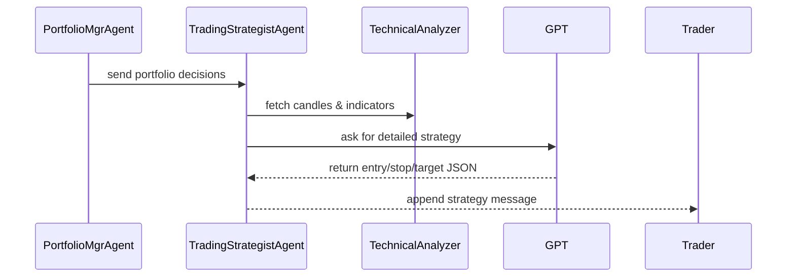

# Chapter 6: Trading Strategist Agent

Welcome back! In [Chapter 5: Risk & Portfolio Management Agents](05_risk___portfolio_management_agents_.md) we sized our positions and decided “buy 20 AAPL, hold MSFT.” Now it’s time for the **Trading Strategist Agent** to turn those decisions into a concrete execution plan—entry price, stop-loss, targets, and risk/reward.

## Why a Trading Strategist Agent?

Imagine you’ve decided to buy 20 shares of AAPL. Next you need to know:

- At what exact price should you enter?
- Where will you place a stop-loss if things go wrong?
- What’s your profit target and risk/reward ratio?
- What criteria must trigger your trade?

The **Trading Strategist Agent** is like an expert trader sitting down, studying the candlestick charts and indicators, and drawing up the full “battle plan” for each signal.

## Key Concepts

1. **PortfolioDecision Input**
   A simple JSON with your action (`buy/sell/hold`), quantity, and ticker name.

2. **Technical Analysis**
   We run a `TechnicalAnalyzer` to fetch recent candlestick data and compute indicators (ATR, momentum, volume patterns).

3. **Strategy Generation**
   We package the analysis and decision into a prompt for an LLM (the “Chart Pattern Analyst GPT”), asking it to suggest:

   - Entry condition
   - Stop-loss price
   - Target price
   - Risk:Reward ratio

4. **TradingStrategyResponse Output**
   A structured JSON with all details for each ticker:
   ```json
   {
     "AAPL": {
       "entry": 150.00,
       "stop_loss": 147.00,
       "target": 158.00,
       "risk_reward": 1:3
     }
   }
   ```

## How to Use the Trading Strategist Agent

Here’s a minimal example showing how to plug in your portfolio decisions:

```python
# 1. Build a fake state with one decision
state = {
  "data": {
    "analyst_signals": {
      "portfolio_management_agent": {
        "AAPL": {"action":"buy","quantity":20,"ticker":"AAPL"}
      }
    }
  },
  "messages": [],
  "metadata": {"show_reasoning": False}
}

# 2. Call the agent
from alpacalyzer.trading.trading_strategist import trading_strategist_agent
output = trading_strategist_agent(state)

# 3. Inspect the last message (our strategy plan)
print(output["messages"][-1].content)
```

After running, you’ll see a JSON string with each ticker’s entry, stop, target, and risk/reward.

## What Happens Under the Hood?



1. **Portfolio Manager** hands off your `buy/sell` decisions.
2. **TechnicalAnalyzer** collects recent candles and computes scores.
3. The agent builds a prompt and calls the **LLM**.
4. The LLM replies with a well-structured strategy.
5. Finally, the agent returns your messages plus the strategy JSON.

## Inside the Code

Below is a simplified look at `src/alpacalyzer/trading/trading_strategist.py`.

### 1. Loop Through Decisions

```python
# Extract the decisions from state
decisions = state["data"]["analyst_signals"]["portfolio_management_agent"]

for ticker, details in decisions.items():
    # Skip holds
    if details["action"] == "hold":
        continue
    # Validate and use the decision
    decision = PortfolioDecision.model_validate(details)
    …
```

This picks only `buy` or `sell` ideas and turns them into `PortfolioDecision` objects.

### 2. Run Technical Analysis

```python
signals = TechnicalAnalyzer().analyze_stock(decision.ticker)
if not signals:
    continue  # no data, skip
```

We grab the latest price, ATR, momentum, volume, and candles needed for the LLM.

### 3. Generate Strategies via GPT

```python
# Ask our GPT expert for entry, stop, target
strategy = get_trading_strategies(signals, decision)
trading_strategies[decision.ticker] = strategy
```

Under the hood, `get_trading_strategies` builds a system + user prompt, feeds the CSV of recent candles, and returns a `TradingStrategyResponse` containing all the fields we need.

### 4. Package the Result

```python
from langchain_core.messages import HumanMessage

msg = HumanMessage(
  content=json.dumps(
    {t: s.model_dump() for t, s in trading_strategies.items()}
  ),
  name="trading_strategist_agent"
)
return {
  "messages": state["messages"] + [msg],
  "data": state["data"]
}
```

We wrap the strategies in a `HumanMessage` and return it so the **Trader** can pick it up in its next loop.

## Conclusion

In this chapter you learned how the **Trading Strategist Agent** converts rough “buy/sell” signals into a complete execution plan: entry criteria, stop-loss, targets, and risk/reward analysis. Next up, we’ll dive into our data models and how we store all these signals in [Chapter 7: Data Layer & Models](07_data_layer___models_.md). Happy coding!

---

Generated by [AI Codebase Knowledge Builder](https://github.com/The-Pocket/Tutorial-Codebase-Knowledge)
