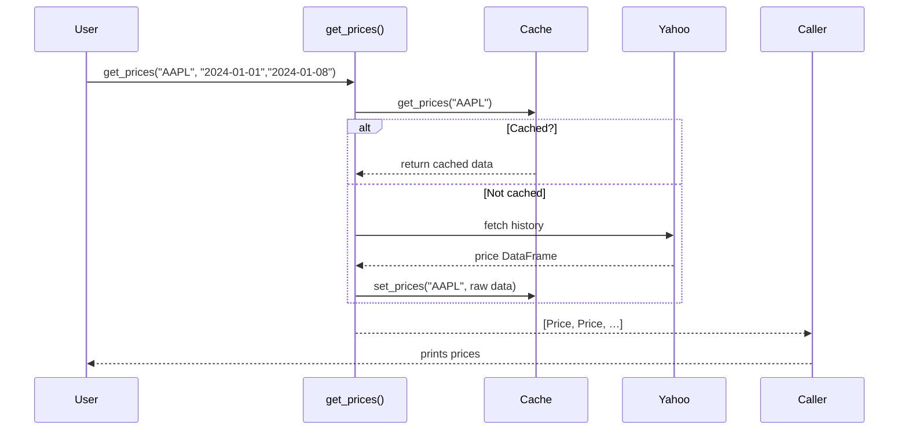

# Chapter 7: Data Layer & Models

Welcome back! In [Chapter 6: Trading Strategist Agent](06_trading_strategist_agent_.md) we saw how to turn portfolio decisions into concrete entry/exit plans. Before we can analyze or trade, we need reliable market data—and that’s exactly what the **Data Layer & Models** give us.

---

## Why a Data Layer?

Imagine you want to fetch last week’s price history for AAPL, plus insider trades and news, without writing dozens of API calls and parsing code every time.

The **Data Layer** is your:

- “Market-data library”: one place to fetch prices, metrics, news, and insider trades.
- Cache: stores recent results so you don’t hammer external APIs.
- Standardizer: returns Pydantic models so every part of the bot gets the same structured data.

**Use Case**
Fetch daily prices for AAPL from 2024-01-01 to 2024-01-08 and get a list of `Price` objects you can feed into your analyzer.

---

## Key Concepts

1. **Pydantic Models**
   Define the shape of your data (e.g., `Price`, `FinancialMetrics`, `CompanyNews`, `InsiderTrade`).

2. **API Functions**
   In `data/api.py`, functions like `get_prices`, `get_financial_metrics`, `get_company_news`, and `get_insider_trades` fetch, parse, and cache data.

3. **Cache Store**
   In `data/cache.py`, an in-memory `Cache` class merges new data and avoids duplicates. Every API call checks this first.

4. **Multi-Source Fallback**
   For prices, we try the cache, then Yahoo Finance, and can add more sources later.

---

## How to Use: Fetch Prices

Here’s a minimal example of fetching prices:

```python
from alpacalyzer.data.api import get_prices

# Fetch AAPL prices from Jan 1 to Jan 8, 2024
prices = get_prices("AAPL", start_date="2024-01-01", end_date="2024-01-08")

# prices is a list of Price models
for p in prices:
    print(p.time, p.open, p.close)
```

What happens:

1. Checks cache for “AAPL”.
2. If not cached, calls Yahoo Finance via yfinance.
3. Parses each row into a `Price` model.
4. Caches the result and returns a list of models.

---

## Under the Hood: Step-by-Step



---

## Inside the Code

### 1. Pydantic Model for Price

File: `src/alpacalyzer/data/models.py`

```python
from pydantic import BaseModel

class Price(BaseModel):
    time: str
    open: float
    high: float
    low: float
    close: float
    volume: int
```

This ensures every price object has the same fields and types.

### 2. Simple `get_prices` Implementation

File: `src/alpacalyzer/data/api.py`

```python
from yfinance import Ticker
from alpacalyzer.data.cache import get_cache
from alpacalyzer.data.models import Price

_cache = get_cache()

def get_prices(ticker, start_date, end_date):
    if cached := _cache.get_prices(ticker):
        return [Price(**d) for d in cached if start_date <= d["time"] <= end_date]

    # Fetch from Yahoo Finance
    df = Ticker(ticker).history(start=start_date, end=end_date)
    prices = [
        Price(
          time=idx.strftime("%Y-%m-%d"),
          open=row.Open, high=row.High,
          low=row.Low, close=row.Close,
          volume=row.Volume
        )
        for idx, row in df.iterrows()
    ]

    _cache.set_prices(ticker, [p.model_dump() for p in prices])
    return prices
```

- **Line 1–3**: Check cache and parse into `Price` models.
- **Line 6–13**: Fetch from Yahoo, build `Price`, cache and return.

### 3. Cache Merge Logic

File: `src/alpacalyzer/data/cache.py`

```python
class Cache:
    def __init__(self):
        self._prices_cache = {}

    def get_prices(self, ticker):
        return self._prices_cache.get(ticker)

    def set_prices(self, ticker, data):
        # Avoid duplicates by date
        existing = self._prices_cache.get(ticker, [])
        new = [d for d in data if d["time"] not in {e["time"] for e in existing}]
        self._prices_cache[ticker] = existing + new
```

This simple merge keeps your cache fresh without duplicate dates.

---

## Conclusion

You’ve learned how the **Data Layer & Models**:

- Provide easy, uniform access to market data.
- Use Pydantic models (`Price`, `FinancialMetrics`, etc.) for structured data.
- Cache results to speed up your bot and reduce API calls.

Armed with this market-data library, you’re ready to build indicators in the [Chapter 8: Technical Analysis Engine](08_technical_analysis_engine_.md).

Happy coding!

---

Generated by [AI Codebase Knowledge Builder](https://github.com/The-Pocket/Tutorial-Codebase-Knowledge)
