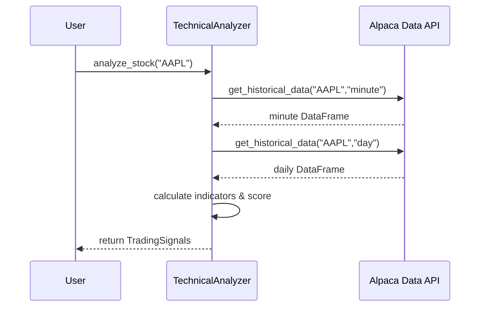

# Chapter 8: Technical Analysis Engine

Welcome back! In [Chapter 7: Data Layer & Models](07_data_layer___models_.md) we learned how to fetch and cache market data as clean Pydantic models. Now we’ll build our **Technical Analysis Engine**—the “digital technician” that reads those price charts, crunches indicators like EMA, RSI, Bollinger Bands, ATR, candlestick patterns, and then turns them into numeric scores and simple **buy/hold/sell** signals.

---

## 8.1 Why a Technical Analysis Engine?

Imagine you’re a technician in a guitar shop:

1. You examine each guitar (price bars).
2. You measure neck relief, fret wear, pickup strength (indicators).
3. You give each guitar a grade and a recommendation: “Good for rock,” “Avoid,” or “Hold for resale.”

Our **TechnicalAnalyzer** does the same for stocks:

- Grabs historical bars (daily and intraday)
- Computes dozens of indicators (RSI, MACD, VWAP, candlestick patterns…)
- Combines them into a **raw score**
- Normalizes it to 0–1
- Emits a list of trading signals and a summary **score**

**Use Case**
Get a quick “TechnicalSignals” summary for AAPL so our Trader can decide whether to buy, sell, or wait.

---

## 8.2 Key Concepts

1. **TechnicalAnalyzer**
   A single class with methods to fetch data, calculate indicators, and build a score.

2. **Historical Data Fetching**
   Under the hood it calls Alpaca’s bar API (with caching via `timed_lru_cache`) to get recent minute and daily bars.

3. **Indicator Computation**
   Uses `talib` to calculate ATR, RSI, MACD, Bollinger Bands, candlestick patterns, relative volume, ADX, VWAP, and more.

4. **Scoring & Signals**

   - Builds a `raw_score` by adding/subtracting points for each indicator.
   - Normalizes to `score` in [0,1].
   - Collects human-readable signal strings (e.g. “TA: Bullish Engulfing”).

5. **TradingSignals**
   A `TypedDict` that holds everything: symbol, price, atr, momentum, raw_data frames, the final `score`, and the list of `signals`.

---

## 8.3 How to Use the TechnicalAnalyzer

Here’s the simplest way to get started:

```python
from alpacalyzer.analysis.technical_analysis import TechnicalAnalyzer

ta = TechnicalAnalyzer()
signals = ta.analyze_stock("AAPL")   # returns a TradingSignals dict
print(signals["symbol"], signals["score"], signals["signals"])
```

What you’ll see:

- `signals["score"]`: a float between 0 (very weak) and 1 (very strong)
- `signals["signals"]`: a list of descriptions like “TA: Overbought RSI (75.2)”

---

## 8.4 What Happens Under the Hood?



1. **analyze_stock** calls `get_historical_data` twice (intraday & daily).
2. It passes the DataFrames to `calculate_intraday_indicators` and `calculate_daily_indicators`.
3. It merges results in `calculate_technical_analysis_score`, computes raw points, normalizes, and attaches signals.

---

## 8.5 Inside the Code (Simplified)

Below are trimmed-down snippets from `src/alpacalyzer/analysis/technical_analysis.py` to show core ideas.

### 8.5.1 Fetching Bars with Caching

```python
@timed_lru_cache(seconds=60)
def get_historical_data(self, symbol, request_type):
    # Build a StockBarsRequest…
    bars = history_client.get_stock_bars(request).data[symbol]
    return pd.DataFrame([{"open":b.open,"high":b.high,…} for b in bars])
```

Explanation:
We wrap the Alpaca call in a timed LRU cache so repeated calls within a minute use local memory.

### 8.5.2 Calculating Intraday Indicators

```python
def calculate_intraday_indicators(self, df):
    df["ATR"] = talib.ATR(df.high, df.low, df.close, timeperiod=30)
    df["MACD"], df["MACD_Signal"], _ = talib.MACD(df.close)
    df["RVOL"] = df.volume / talib.SMA(df.volume, timeperiod=30)
    # … Bollinger Bands, candlestick patterns …
    return df
```

Explanation:
We add new columns to the DataFrame for each indicator using the `talib` library.

### 8.5.3 Raw Scoring & Normalization

```python
def calculate_technical_analysis_score(self, symbol, daily, intraday):
    price = intraday.close.iloc[-1]
    raw = 0
    if price > daily.SMA_20.iloc[-1]: raw += 20  # trend filter
    if daily.RSI.iloc[-1] < 30: raw += 30       # oversold boost
    # … more rules …
    score = (raw + 130) / 260  # maps raw [-130,130] to [0,1]
    return {"symbol":symbol, "price":price, "raw_score":raw, "score":score, "signals": []}
```

Explanation:
We check a handful of conditions, adjust `raw_score`, then normalize with min-max scaling and clamp to 0–1.

---

## 8.6 Conclusion

In this chapter you learned how the **Technical Analysis Engine**:

- Fetches and caches both intraday and daily price bars
- Computes dozens of technical indicators via `talib`
- Builds a raw point-based score and normalizes it to a 0–1 range
- Gathers human-readable **signals** (candlestick patterns, overbought/oversold, trend checks)
- Returns a `TradingSignals` dict that downstream agents or the `Trader` can use to decide entry, exit, or hold

Next up: we’ll use these scores and signals in our **Data Scanners** to filter large lists of tickers for the best candidates. See you in [Chapter 9: Data Scanners](09_data_scanners_.md)!

---

Generated by [AI Codebase Knowledge Builder](https://github.com/The-Pocket/Tutorial-Codebase-Knowledge)
