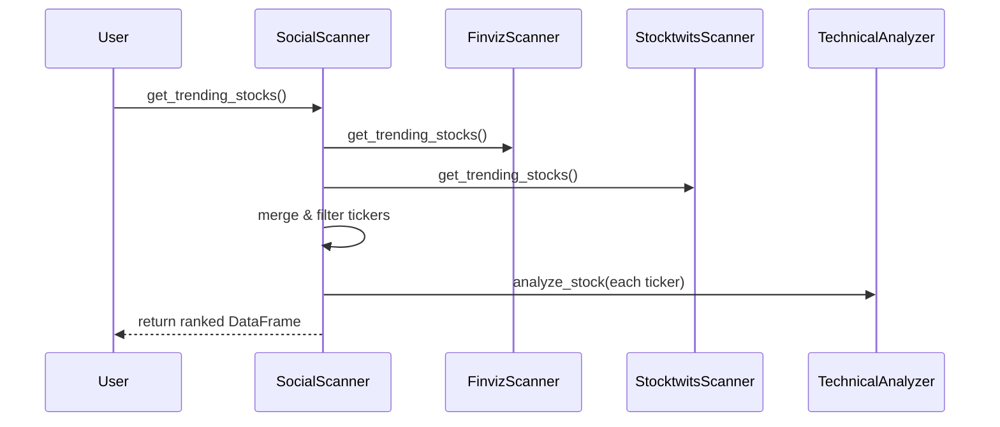

# Chapter 9: Data Scanners

In [Chapter 8: Technical Analysis Engine](08_technical_analysis_engine_.md) we learned how to score a single stock with technical indicators. Now let’s cast a wider net—use **Data Scanners** to pull in hundreds of tickers from the web, spot the “hot” ones, and hand off a ranked list of opportunities to our Trader.

---

## Why Data Scanners?

Imagine you want to know which stocks everyone’s talking about today—on Reddit, Stocktwits, WallStreetBets, and in screeners like Finviz. Manually browsing each site is tedious. **Scanners** are your automated spotters. They:

1. Reach out to each platform’s API or web page.
2. Scrape trending tickers.
3. Score and rank them.
4. Deliver a shortlist of promising names for deeper analysis.

That shortlist then flows into our [Technical Analysis Engine](08_technical_analysis_engine_.md) and trading loops.

---

## Key Concepts

1. **Scanner Classes**

   - `FinvizScanner` (screening filters on Finviz)
   - `StocktwitsScanner` (mentions & sentiment)
   - `WSBScanner` (ApeWisdom data for r/WallStreetBets)
   - `RedditScanner` (raw Reddit posts)
   - `SocialScanner` (glues them all together, adds TA)

2. **Trending Stocks**
   Each scanner has a `get_trending_stocks()` method that returns a `pandas.DataFrame` of tickers, scores, mentions, etc.

3. **Ranking & Combining**
   The `SocialScanner` collects tickers from all sources, drops duplicates, filters out ETFs, then calls each scanner’s ranking method and merges results. It finishes by running **TechnicalAnalyzer** for a final score.

---

## How to Use Data Scanners

Here’s the simplest way to get your top 10 tickers:

```python
from alpacalyzer.scanners.social_scanner import SocialScanner

scanner = SocialScanner()
df = scanner.get_trending_stocks(limit=20)   # Pull up to 20 from each source
print(df[['ticker', 'final_score']].head(5))
```

- `df` is a DataFrame with columns:
  - `ticker`: symbol
  - `sentiment_score`, `sentiment_rank` (Stocktwits & WSB)
  - `technical_score`, `ta_rank`
  - `final_score`, `final_rank`
- You’ll see the top 5 by “final_score”—your hottest tickers to analyze next.

---

## What Happens Under the Hood?



1. **SocialScanner** asks each source for trending tickers.
2. It merges them into one set, filters out ETFs.
3. It calls each scanner’s `get_stock_ranks()` to score sentiment/screen data.
4. Runs `TechnicalAnalyzer` on each symbol.
5. Combines all scores into `final_score` and sorts.

---

## Deep Dive: SocialScanner.get_trending_stocks

File: `src/alpacalyzer/scanners/social_scanner.py`

### 1. Collect Unique Tickers

```python
tickers = set()

# From WSB
wsb_df = self.wsb_scanner.get_trending_stocks(limit)
tickers.update(wsb_df["ticker"])

# From Stocktwits
st_df = self.stocktwits_scanner.get_trending_stocks()
tickers.update(st_df["ticker"])

# From Finviz
fv_df = self.finviz_scanner.get_trending_stocks(limit)
tickers.update(fv_df["ticker"])
```

Each DataFrame has a “ticker” column. We merge into a Python set to avoid duplicates.

### 2. Filter Out ETFs

```python
tickers_list = [t for t in tickers if t not in ("VOO","SPY","QQQ")]
```

We skip broad ETFs and focus on single‐stock ideas.

### 3. Rank by Source

```python
# Stocktwits ranking: mentions & sentiment → st_score, st_rank
st_ranked = self.stocktwits_scanner.get_stock_ranks(pd.DataFrame({"ticker": tickers_list}))

# Finviz ranking: relative volume, RSI, gap, trends → finviz_score, finviz_rank
fv_ranked = self.finviz_scanner.get_stock_ranks(pd.DataFrame({"ticker": tickers_list}))
```

Each scanner’s `get_stock_ranks` returns a DataFrame with `score` and `rank`.

### 4. Merge & Compute Sentiment Metrics

```python
combined = pd.DataFrame({"ticker": tickers_list})
combined = combined.merge(st_ranked[["ticker","score","rank"]], on="ticker", how="left")
combined = combined.merge(fv_ranked[["ticker","score","rank"]], on="ticker", how="left")
combined["sentiment_score"] = (combined["score_x"] + combined["score_y"]) / 2
combined["sentiment_rank"]  = (combined["rank_x"]  + combined["rank_y"])  / 2
```

### 5. Add Technical Scores

```python
ta_results = []
for t in combined["ticker"]:
    data = self.technical_analyzer.analyze_stock(t)
    ta_results.append({"ticker": t, "technical_score": data["score"]})
ta_df = pd.DataFrame(ta_results).sort_values("technical_score", ascending=False)
ta_df["ta_rank"] = range(1, len(ta_df)+1)

combined = combined.merge(ta_df, on="ticker")
combined["final_score"] = combined["sentiment_score"] + combined["technical_score"]
combined = combined.sort_values("final_score").reset_index(drop=True)
```

Now each symbol has a combined “final_score” and you get a sorted list.

---

## Peek at a Single Scanner: FinvizScanner

File: `src/alpacalyzer/scanners/finviz_scanner.py`

```python
from finviz.screener import Screener
import pandas as pd

def get_trending_stocks(self, limit=20):
    # Ask Finviz for stocks under $50 with high volume & positive change
    stock_list = Screener(
      filters=["geo_usa","sh_price_u50","sh_relvol_o1.5","ta_change_u"],
      rows=limit
    )
    return pd.DataFrame(stock_list.data)
```

- Applies simple filters (U.S. stocks, price<\$50, volume surge, positive change).
- Returns a DataFrame you can rank or merge.

---

## Conclusion

In this chapter you learned how **Data Scanners** automate the hunt for trending tickers across multiple platforms:

- `SocialScanner` glues together `FinvizScanner`, `StocktwitsScanner`, `WSBScanner`, plus our own `TechnicalAnalyzer`.
- You get back a neat, ranked `DataFrame` of hot stocks.
- These scanners feed into the Trader loops we built in [Chapter 2: Trading Orchestrator (Trader)](02_trading_orchestrator__trader__.md).

Next up: let’s harness the power of LLMs to craft smart prompts and parse responses in [Chapter 10: GPT Integration](10_gpt_integration_.md).

---

Generated by [AI Codebase Knowledge Builder](https://github.com/The-Pocket/Tutorial-Codebase-Knowledge)
