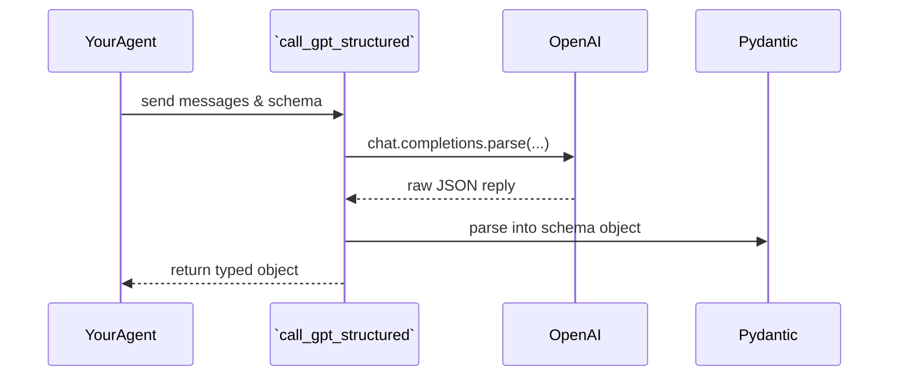

# Chapter 10: GPT Integration

Welcome back! In [Chapter 9: Data Scanners](09_data_scanners_.md) we gathered hot tickers and scored them with our technical engine. Now it’s time to see how we talk to **GPT**—our “expert oracle”—in a clean, structured way.

---

## 10.1 Why GPT Integration?

Imagine you want to ask GPT a question like “What’s the best stop-loss for AAPL?” and get back a neat JSON object:

`{ "entry": 150, "stop_loss": 145, "target": 160 }`

But setting up the Chat API, formatting messages, picking a model, and parsing JSON every time gets repetitive.

**GPT Integration** solves this by providing a tiny wrapper that:

1. Formats messages for you.
2. Calls OpenAI’s “o3-mini” chat endpoint.
3. Parses the reply into your Pydantic classes.

Now any agent can do a “chat” with function-like schemas in just one line:

```python
from alpacalyzer.gpt.call_gpt import call_gpt_structured

strategy = call_gpt_structured(messages, TradingStrategyResponse)
```

---

## 10.2 Key Concepts

1. **OpenAI Client**
   A single `OpenAI` object (from the `openai` package) configured with your API key.

2. **Messages**
   A list of chat messages (system, user) using LangChain’s `HumanMessage` or simple dicts.

3. **Function Schemas**
   Pydantic models (like `TradingStrategyResponse`) that describe the JSON shape you expect.

4. **call_gpt_structured**
   One function that sends your messages and schema to the “o3-mini” model, then returns a typed object.

---

## 10.3 How to Use GPT Integration

Let’s see a minimal example. Suppose you have a prompt and a schema:

```python
from langchain_core.messages import HumanMessage

messages = [
  HumanMessage(role="system", content="You are a trading assistant."),
  HumanMessage(role="user",   content="Suggest entry, stop, target for AAPL.")
]
```

Here we ask GPT for strategy details. Next, call our wrapper:

```python
from alpacalyzer.gpt.call_gpt import call_gpt_structured
from alpacalyzer.trading.schemas import TradingStrategyResponse

response = call_gpt_structured(messages, TradingStrategyResponse)

# response is now a TradingStrategyResponse Pydantic object:
print(response.entry, response.stop_loss, response.target)
```

What happens:

- `call_gpt_structured` sends `messages` + schema to GPT.
- GPT replies in JSON matching `TradingStrategyResponse`.
- We get back a fully validated Python object—no manual parsing needed!

---

## 10.4 What Happens Under the Hood?



1. **Agent** calls `call_gpt_structured`.
2. **Wrapper** invokes `client.beta.chat.completions.parse` with model “o3-mini.”
3. **OpenAI** returns JSON that matches your Pydantic schema.
4. **Wrapper** hands you back a Python object ready to use.

---

## 10.5 Under-the-Hood Code Walkthrough

### 10.5.1 Client Initialization

File: `src/alpacalyzer/gpt/call_gpt.py`

```python
from openai import OpenAI
from dotenv import load_dotenv

load_dotenv()               # loads OPENAI_API_KEY
client = OpenAI()
client.api_key = os.getenv("OPENAI_API_KEY")
```

_We load your API key once and reuse the same `client` everywhere._

### 10.5.2 The Wrapper Function

```python
from typing import TypeVar, cast

T = TypeVar("T")

def call_gpt_structured(messages, function_schema: type[T]) -> T | None:
    resp = client.beta.chat.completions.parse(
      model="o3-mini",
      reasoning_effort="medium",
      messages=messages,
      response_format=function_schema,
    )
    return cast(T, resp.choices[0].message.parsed)
```

- **`messages`**: your system/user chat history.
- **`function_schema`**: a Pydantic class describing the JSON you want.
- **`parse`**: auto-formats and returns a `parsed` object.

If something goes wrong, you’ll get `None` and can retry or log an error.

---

## 10.6 Analogy: Ordering at a Café

- You (Agent) tell the **wrapper** your order (“Latte with oat milk”).
- The wrapper translates it into the café’s language (OpenAI’s chat API).
- The café (OpenAI) makes your drink (JSON response).
- The wrapper checks it against our menu (Pydantic schema) and hands you the finished latte (a typed Python object).

---

## Conclusion

You’ve learned how **GPT Integration** neatly hides the complexity of:

- Formatting messages
- Picking the “o3-mini” model
- Parsing structured JSON into Pydantic objects

Now any agent can chat with GPT in one simple call!

Up next, we’ll look at some **utility modules** that glue everything together and make common tasks even easier: [Chapter 11: Utility Modules](11_utility_modules_.md).

---

Generated by [AI Codebase Knowledge Builder](https://github.com/The-Pocket/Tutorial-Codebase-Knowledge)
