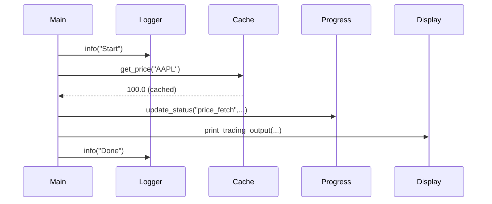

# Chapter 11: Utility Modules

In the previous chapter we learned how to talk to GPT in [Chapter 10: GPT Integration](10_gpt_integration_.md). Now let’s look at the small but mighty **Utility Modules** that tie everything together: logging, pretty display, timed caching, and live progress bars.

## Why Utility Modules?

Imagine running your trading bot day and night. You want to:

1. Write clean logs to file and console (so you can debug later).
2. Show colorful tables in the terminal (so you can read results at a glance).
3. Cache expensive calls for a short time (so you don’t hammer APIs).
4. Watch a live “scoreboard” of each agent’s progress (so you know what’s running).

These **Utility Modules** solve exactly those needs.

## Key Concepts

1. **Logger (`logger.py`)**
   Configures a console logger (INFO+) and a rotating file logger (DEBUG+).
2. **Display (`display.py`)**
   Uses `tabulate` and `colorama` to print colored tables for strategies and signals.
3. **Cache Utils (`cache_utils.py`)**
   A `timed_lru_cache` decorator that expires entries after N seconds.
4. **Progress (`progress.py`)**
   A live-updating terminal table (via `rich`) to track each agent’s status.

---

## 11.1 Logger

Use case: record every step of your bot to both console and a daily‐rotated log file.

Example usage:

```python
from alpacalyzer.utils.logger import get_logger

logger = get_logger()

logger.info("Starting trading cycle")
logger.debug(f"Found opportunities: {tickers}")
```

This prints INFO+ messages to the console (no stack traces) and writes DEBUG+ to `trading_logs.log`.

Under the hood (src/alpacalyzer/utils/logger.py):

```python
file_handler = TimedRotatingFileHandler("trading_logs.log", when="midnight")
console_handler = logging.StreamHandler()
logger = logging.getLogger(__name__)
logger.setLevel(logging.DEBUG)
logger.addHandler(file_handler)
logger.addHandler(console_handler)
```

A filter on the console handler strips tracebacks so your terminal stays clean.

---

## 11.2 Display

Use case: after trading decisions, show a colorful table of each ticker’s signals and final orders.

Example usage:

```python
from alpacalyzer.utils.display import print_trading_output

print_trading_output(result_dict)
```

This prints agent analyses, decisions, portfolio summary, and strategies in nicely aligned, colored grids.

Under the hood (src/alpacalyzer/utils/display.py):

```python
def print_trading_output(result):
    # Build rows for each ticker using colorama and tabulate
    print(tabulate(table_data, headers=headers, tablefmt="grid"))
```

Helpers like `wrap_text` ensure long reasoning blocks wrap at 60 characters, and `sort_agent_signals` orders rows consistently.

---

## 11.3 Cache Utils

Use case: cache repeated data fetches—like price candles or indicator calls—for a short window.

Example usage:

```python
from alpacalyzer.utils.cache_utils import timed_lru_cache

@timed_lru_cache(seconds=30)
def fetch_order_book(ticker):
    # expensive API call
    return client.get_order_book(ticker)
```

Calls within 30 seconds return the cached result; after that, the cache entry expires automatically.

Under the hood (src/alpacalyzer/utils/cache_utils.py):

```python
def timed_lru_cache(seconds, maxsize=128):
    # Wraps functools.lru_cache and tracks timestamps per key
    def decorator(func):
        cached = lru_cache(maxsize)(func)
        timestamps = {}
        def wrapped(*args, **kwargs):
            # If an entry is older than `seconds`, clear that cache
            return cached(*args, **kwargs)
        return wrapped
    return decorator
```

---

## 11.4 Progress

Use case: when you run multiple agents in parallel, show a live table like a sport scoreboard.

Example usage:

```python
from alpacalyzer.utils.progress import progress

progress.start()
progress.update_status("scan_agent", ticker="AAPL", status="done")
progress.update_status("risk_manager", status="running")
progress.stop()
```

This spins up a `rich` live display that refreshes 4 times/sec and shows ✓/⋯/✗ icons.

Under the hood (src/alpacalyzer/utils/progress.py):

```python
class AgentProgress:
    def __init__(self):
        self.status = {}
        self.live = Live(Table(), console=Console())
    def start(self): self.live.start()
    def update_status(self, name, ticker=None, status=""):
        self.status[name] = {"ticker": ticker or "", "status": status}
        self._refresh_display()
    def stop(self): self.live.stop()

progress = AgentProgress()
```

---

## 11.5 Putting It All Together

Here’s a minimal snippet showing all four modules in action:

```python
from alpacalyzer.utils.logger    import logger
from alpacalyzer.utils.progress  import progress
from alpacalyzer.utils.cache_utils import timed_lru_cache
from alpacalyzer.utils.display   import print_trading_output

logger.info("Bot starting")
progress.start()

@timed_lru_cache(seconds=10)
def get_price(t):
    # imagine API call
    return 100.0

price = get_price("AAPL")
progress.update_status("price_fetch", ticker="AAPL", status="done")

# imagine result_dict from Trader
print_trading_output({"analyst_signals": {}, "decisions": {}, "portfolio": {}})

progress.stop()
logger.info("Bot finished")
```

---

## Internal Sequence of Events



1. **Main** logs start.
2. **Cache** serves or fetches data.
3. **Progress** updates live table.
4. **Display** prints final results.
5. **Logger** logs completion.

---

## Conclusion

In this chapter you met the four **Utility Modules** that make your trading bot robust and user-friendly:

- **Logger**: console + rotating file logs without tracebacks.
- **Display**: colored, wrapped tables for analysis and decisions.
- **Cache Utils**: time-based LRU caching to throttle repeated calls.
- **Progress**: live, styled agent status display in the console.

With these tools in place, your next step will be to dive into any custom feature you like—your bot’s foundation is now solid and easy to debug!

---

Generated by [AI Codebase Knowledge Builder](https://github.com/The-Pocket/Tutorial-Codebase-Knowledge)
