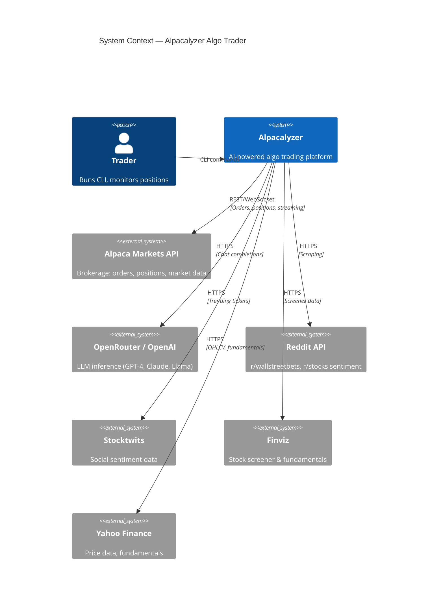
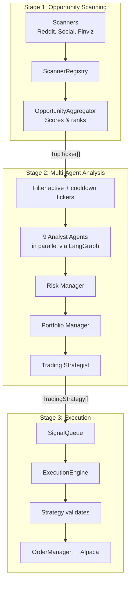

# Architecture Overview

> Alpacalyzer is an AI-powered algorithmic trading platform that combines technical analysis, social sentiment, and multi-agent LLM decision-making to execute automated strategies via Alpaca Markets.

## Table of Contents

- [Tech Stack](#tech-stack)
- [System Context](#system-context)
- [Pipeline Flow](#pipeline-flow)
- [Package Map](#package-map)
- [Package Layering](#package-layering)
- [Import Direction Rules](#import-direction-rules)
- [Component Guide](#component-guide)
- [Agent Decision Framework](#agent-decision-framework)
- [Event System](#event-system)
- [Design Patterns](#design-patterns)
- [Configuration](#configuration)
- [Migration Context](#migration-context)

---

## Tech Stack

| Layer              | Technology              | Purpose                                                                |
| ------------------ | ----------------------- | ---------------------------------------------------------------------- |
| Language           | Python 3.13+            | Core runtime                                                           |
| Package Manager    | uv                      | Dependency management                                                  |
| Build System       | Hatchling               | PEP 517 build backend                                                  |
| Brokerage          | alpaca-py               | Trading API client                                                     |
| LLM Framework      | LangGraph + LangChain   | Agent DAG orchestration                                                |
| LLM Client         | OpenAI SDK + instructor | Chat completions (OpenRouter-compatible), structured output with retry |
| Data Models        | Pydantic v2             | Validation, serialization, LLM output hardening                        |
| Data Analysis      | pandas + numpy          | Time series, numerical computation                                     |
| Technical Analysis | pandas-ta               | Indicators (RSI, MACD, Bollinger, etc.)                                |
| Market Data        | yfinance                | OHLCV, fundamentals                                                    |
| Screener           | finviz (fork)           | Stock screening                                                        |
| Scheduling         | schedule                | Periodic task execution                                                |
| Streaming          | websockets              | Alpaca trade update streaming                                          |
| Linting            | ruff                    | Linting + formatting                                                   |
| Type Checking      | ty                      | Static type analysis                                                   |
| Testing            | pytest                  | Test framework                                                         |

Full dependency list: [`pyproject.toml`](../../pyproject.toml)

---

## System Context



---

## Pipeline Flow

The system operates as a three-stage pipeline, orchestrated by [`TradingOrchestrator`](../../src/alpacalyzer/orchestrator.py):



### Scheduling

| Schedule             | Action                                            | Entry Point                     |
| -------------------- | ------------------------------------------------- | ------------------------------- |
| Every 15 min         | Full cycle: scan → analyze → execute              | `orchestrator.run_cycle()`      |
| Every 2 min          | Execution only: process signals, manage positions | `orchestrator.execute_cycles()` |
| Daily (close - 5min) | Liquidate all positions                           | `liquidate_all_positions()`     |
| Continuous           | WebSocket trade update streaming                  | `consume_trade_updates()`       |

Scheduling is configured in [`cli.py`](../../src/alpacalyzer/cli.py).

---

## Package Map

```
src/alpacalyzer/
├── cli.py                 # CLI entry point (argparse + scheduling)
├── orchestrator.py        # Pipeline coordinator: scan → analyze → execute
├── hedge_fund.py          # LangGraph DAG: multi-agent analysis workflow
├── agents/                # 9 specialized LLM analyst agents
├── analysis/              # TechnicalAnalyzer, dashboard, EOD reports
├── backtesting/           # Strategy backtester
├── data/                  # Core Pydantic models + data fetchers
├── events/                # Structured event system (emit + handlers)
├── execution/             # ExecutionEngine, SignalQueue, PositionTracker, OrderManager
├── graph/                 # LangGraph AgentState definition
├── llm/                   # LLMClient abstraction (tiered models, instructor-based structured output)
├── pipeline/              # ScannerRegistry, OpportunityAggregator, Scanner protocol
├── prompts/               # Agent prompt templates (Markdown)
├── scanners/              # Reddit, Social, Finviz, Stocktwits scanners
├── strategies/            # Strategy protocol, 3 implementations, registry
├── sync/                  # Journal sync client
├── trading/               # Alpaca client, risk/portfolio/strategist agents
└── utils/                 # Logger, progress display, caching, formatting
```

---

## Package Layering

```
                    ┌──────────┐
                    │   CLI    │
                    └────┬─────┘
                         │
                    ┌────▼─────┐
                    │Orchestrator│
                    └────┬─────┘
                         │
            ┌────────────┼────────────┐
            │            │            │
       ┌────▼────┐  ┌───▼────┐  ┌───▼─────┐
       │Pipeline │  │Hedge   │  │Execution│
       │         │  │Fund    │  │         │
       └────┬────┘  └───┬────┘  └───┬─────┘
            │            │           │
       ┌────▼────┐  ┌───▼────┐  ┌───▼─────┐
       │Scanners │  │Agents  │  │Strategies│
       └────┬────┘  └───┬────┘  └───┬─────┘
            │            │           │
            └────────────┼───────────┘
                         │
            ┌────────────┼────────────┐
            │            │            │
       ┌────▼────┐  ┌───▼────┐  ┌───▼─────┐
       │  Data   │  │  LLM   │  │ Trading │
       │ Models  │  │        │  │ (Alpaca)│
       └─────────┘  └────────┘  └─────────┘

       Cross-cutting: Events (any layer can emit), Utils (any layer can use)
```

---

## Import Direction Rules

```
ALLOWED:
  CLI → Orchestrator
  Orchestrator → Pipeline, HedgeFund, Execution, Strategies
  Pipeline → Scanners, Events
  HedgeFund → Agents, LLM, Events
  Execution → Strategies, Trading, Events
  Strategies → Analysis, Events
  Agents → LLM, Prompts, Events

FORBIDDEN:
  ✗ Lower layers cannot import upper layers
  ✗ Execution cannot import CLI
  ✗ Strategies cannot import Orchestrator
  ✗ Scanners cannot import Execution
```

Enforced by [`tests/test_lint_architecture.py`](../../tests/test_lint_architecture.py).

---

## Component Guide

### CLI

Entry point via `uv run alpacalyzer`. Uses argparse with modes for full trading, analysis-only, dry-run, dashboard, EOD analysis, strategy selection, direct tickers, and agent mode selection. Sets up periodic scheduling and optional WebSocket streaming.

→ [`src/alpacalyzer/cli.py`](../../src/alpacalyzer/cli.py)

### Orchestrator

Coordinates the three pipeline stages: `scan()` → `analyze()` → `execute()`. Manages market status checks, filters out active/cooldown tickers before analysis, and delegates all execution to the ExecutionEngine. Does not execute trades directly.

→ [`src/alpacalyzer/orchestrator.py`](../../src/alpacalyzer/orchestrator.py)

### Opportunity Pipeline

Pluggable scanner system built on the `Scanner` protocol and `BaseScanner` ABC. Scanners produce `ScanResult` objects; the `OpportunityAggregator` scores and ranks them by source diversity, freshness, social proof, ranking position, and technical match.

→ [`src/alpacalyzer/pipeline/`](../../src/alpacalyzer/pipeline/) — protocol in `scanner_protocol.py`, scoring in `aggregator.py`, registration in `registry.py`

### Hedge Fund Agent Framework

LangGraph DAG workflow with 9 analyst agents running in parallel, followed by a sequential decision chain: Risk Manager → Portfolio Manager → Trading Strategist. Agent selection is controlled by mode (ALL, TRADE, INVEST). State flows through `AgentState` TypedDict with LangGraph reducers.

Agents are registered in `ANALYST_CONFIG` — a single source of truth that the DAG reads from automatically.

→ [`src/alpacalyzer/hedge_fund.py`](../../src/alpacalyzer/hedge_fund.py) (DAG), [`src/alpacalyzer/agents/agents.py`](../../src/alpacalyzer/agents/agents.py) (registry), [`src/alpacalyzer/graph/state.py`](../../src/alpacalyzer/graph/state.py) (state)

### Execution Engine

Single-loop engine with five sub-components: SignalQueue (priority heap, max 50, 4hr TTL), PositionTracker (open positions, P&L, bracket sync), CooldownManager (3hr post-exit), OrderManager (bracket orders to Alpaca), and a TechnicalAnalyzer signal cache.

Key invariant: exits are always processed before entries (protect capital first).

State is persisted to `.alpacalyzer-state.json` and restored on startup unless `--reset-state` is passed.

→ [`src/alpacalyzer/execution/`](../../src/alpacalyzer/execution/)

### Strategies

Protocol-based pluggable system. Three implementations: MomentumStrategy (agent-integrated, validates proposals), BreakoutStrategy (independent TA), MeanReversionStrategy (independent TA). Auto-registered via `StrategyRegistry` on import.

→ [`src/alpacalyzer/strategies/base.py`](../../src/alpacalyzer/strategies/base.py) (protocol), [`src/alpacalyzer/strategies/registry.py`](../../src/alpacalyzer/strategies/registry.py)

### Technical Analysis

`TechnicalAnalyzer` computes indicators on daily and intraday timeframes: trend (SMA, MACD, ADX), momentum (RSI), volatility (ATR, Bollinger, VIX-adjusted thresholds), volume (RVOL, VWAP), and candlestick patterns. Composite scoring normalized to 0.0–1.0.

→ [`src/alpacalyzer/analysis/technical_analysis.py`](../../src/alpacalyzer/analysis/technical_analysis.py)

### LLM Integration

OpenAI-compatible abstraction via `LLMClient` with three model tiers: FAST (Llama 3.2 3B), STANDARD (Claude 3.5 Sonnet), DEEP (Claude 3.5 Sonnet). All configurable via env vars. Structured output uses the [`instructor`](https://python.useinstructor.com/) library (`Mode.JSON`) for automatic retry-with-validation-feedback — when the LLM returns invalid JSON, `instructor` feeds the Pydantic validation errors back to the LLM and retries (up to `MAX_RETRIES=2`). A manual fallback (`json_object` mode + coercion helpers) catches anything instructor can't fix. Every call emits an `LLMCallEvent`.

→ [`src/alpacalyzer/llm/`](../../src/alpacalyzer/llm/) — client in `client.py`, tiers in `config.py`, structured output in `structured.py`

### Data Models

Core Pydantic v2 models: `TopTicker` (scanner output), `TradingStrategy` (agent output with entry/stop/target), `PortfolioDecision` (portfolio manager output), `FinancialMetrics` (30+ fundamental fields), `EntryDecision`/`ExitDecision` (strategy outputs).

Models that receive LLM output are hardened for common mistakes: `TradingStrategy` has defaults for frequently-omitted fields (`quantity`, `entry_point`, `strategy_notes`), a `field_validator` that coerces `risk_reward_ratio` from `"1:1.47"` → `1.47`, and `entry_criteria` accepts both `list[EntryCriteria]` and plain strings. The `EntryCriteria.entry_type` validator normalizes near-miss enum values (e.g. `"price_above_ma50"` → `"above_ma50"`).

→ [`src/alpacalyzer/data/models.py`](../../src/alpacalyzer/data/models.py), [`src/alpacalyzer/strategies/base.py`](../../src/alpacalyzer/strategies/base.py) (decision types)

---

## Agent Decision Framework

The trading system uses a two-tier authority model:

**Tier 1: Agent (LLM via TradingStrategist)** — Analyzes each ticker from multiple perspectives and proposes an optimal trade setup: entry price, stop loss, target price, position size, trade direction, and entry criteria.

**Tier 2: Strategy (evaluate_entry)** — Validates that the agent's setup fits the strategy's philosophy. MomentumStrategy checks positive trend/RSI/SMA. BreakoutStrategy checks consolidation patterns. MeanReversionStrategy checks oversold/overbought conditions.

Key invariant: **Agents propose, strategies validate.** Strategies can reject a setup entirely but must never override the agent's calculated trade parameters (entry, stop, target, size).

> Not all strategies currently accept agent recommendations. BreakoutStrategy and MeanReversionStrategy detect opportunities independently through technical analysis. MomentumStrategy is the primary strategy following the agent-propose/validate model. Agent integration for the other strategies is planned.

→ Decision flow documented in [`src/alpacalyzer/strategies/base.py`](../../src/alpacalyzer/strategies/base.py) (Strategy protocol docstring)
→ Agent output: [`src/alpacalyzer/trading/trading_strategist.py`](../../src/alpacalyzer/trading/trading_strategist.py)

---

## Event System

Singleton `EventEmitter` with pluggable handlers: `ConsoleEventHandler` (human-readable log with emoji prefixes) and `FileEventHandler` (JSON Lines to `logs/events.jsonl` with 10MB rotation, 3 backups).

All trading state changes emit typed Pydantic events via `emit_event()`. Event types cover the full lifecycle: scanning, signal generation/expiration, entry/exit triggers, order submission/fill, position open/close, cooldown start/end, execution cycles, LLM calls, agent reasoning, and errors.

→ Event types: [`src/alpacalyzer/events/models.py`](../../src/alpacalyzer/events/models.py)
→ Emitter + handlers: [`src/alpacalyzer/events/emitter.py`](../../src/alpacalyzer/events/emitter.py)
→ Metrics analysis: [`scripts/agent_metrics_summary.py`](../../scripts/agent_metrics_summary.py)

---

## Design Patterns

| Pattern                      | Where                                                  | Why                                                     |
| ---------------------------- | ------------------------------------------------------ | ------------------------------------------------------- |
| Pipeline / Chain             | `TradingOrchestrator`                                  | Clean separation of scan → analyze → execute stages     |
| Registry                     | `StrategyRegistry`, `ScannerRegistry`                  | Pluggable components without modifying callers          |
| Protocol (Structural Typing) | `Strategy`, `Scanner`                                  | Duck typing with `@runtime_checkable` for flexibility   |
| Singleton                    | `EventEmitter`, `LLMClient`                            | Thread-safe shared instances for cross-cutting concerns |
| Observer                     | `EventEmitter` + handlers                              | Decouple event production from consumption              |
| Strategy (GoF)               | `strategies/`                                          | Interchangeable entry/exit evaluation algorithms        |
| Adapter                      | `scanners/adapters.py`, `pipeline/scanner_adapters.py` | Legacy scanners adapted to Scanner protocol             |
| DAG Workflow                 | `hedge_fund.py` via LangGraph                          | Parallel analyst fan-out → sequential decision chain    |
| Priority Queue               | `SignalQueue`                                          | Process highest-confidence signals first                |
| Template Method              | `BaseScanner._execute_scan()`                          | Common scan logic with customizable execution           |
| Facade                       | `TradingOrchestrator`                                  | Simplified interface over pipeline + agents + execution |

---

## Configuration

### Environment Variables

| Variable             | Required | Default                            | Description               |
| -------------------- | -------- | ---------------------------------- | ------------------------- |
| `ALPACA_API_KEY`     | Yes      | —                                  | Alpaca Markets API key    |
| `ALPACA_SECRET_KEY`  | Yes      | —                                  | Alpaca Markets secret key |
| `LLM_API_KEY`        | Yes      | —                                  | OpenAI-compatible API key |
| `LLM_BASE_URL`       | No       | `https://openrouter.ai/api/v1`     | LLM provider base URL     |
| `LLM_MODEL_FAST`     | No       | `meta-llama/llama-3.2-3b-instruct` | Fast tier model           |
| `LLM_MODEL_STANDARD` | No       | `anthropic/claude-3.5-sonnet`      | Standard tier model       |
| `LLM_MODEL_DEEP`     | No       | `anthropic/claude-3.5-sonnet`      | Deep tier model           |

→ Full env template: [`.env.example`](../../.env.example)
→ LLM tier config: [`src/alpacalyzer/llm/config.py`](../../src/alpacalyzer/llm/config.py)

---

## Migration Context

All phases of the architecture migration are complete:

- **Phase 1**: `strategies/` module with 3 strategies
- **Phase 2**: `execution/` module (ExecutionEngine, SignalQueue, PositionTracker, CooldownManager, OrderManager)
- **Phase 3**: `events/` module with structured JSON logging
- **Phase 4**: `pipeline/` module (ScannerRegistry, OpportunityAggregator)
- **Phase 5**: Backtesting framework and performance dashboard
- **Phase 6**: Clean break — `Trader` class removed, `TradingOrchestrator` is the sole entry point

→ Historical details: [`migration_roadmap.md`](../../migration_roadmap.md)
→ ADRs: [`docs/architecture/decisions/`](decisions/)
