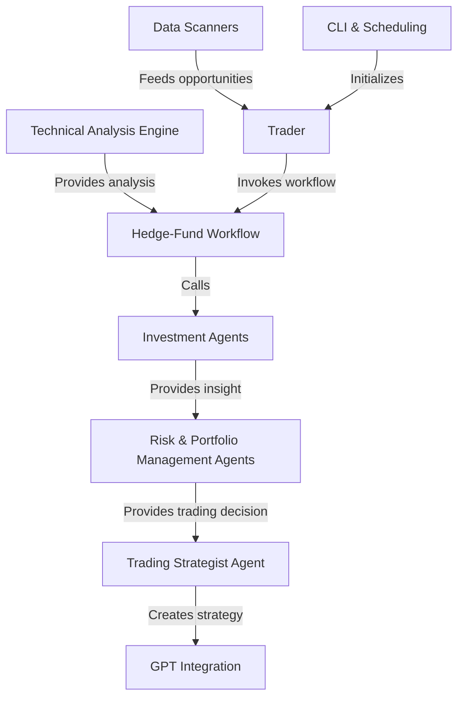

# Alpacalyzer: Algo-trader

**Alpacalyzer Algo Trader** is a modular Python system that _automates research, analysis, and execution_ of stock trades. It integrates **data fetching**, **technical/fundamental models**, and **LLM-powered analyst agents** to generate structured buy/hold/sell signals. A central **workflow graph** streams those signals through risk and portfolio managers into concrete trading strategies, which the **Trader** then schedules and optionally submits to Alpaca for live trading.

**Source Repository:** [https://github.com/kimrejstrom/alpacalyzer-algo-trader](https://github.com/kimrejstrom/alpacalyzer-algo-trader)

## Chapters

1. [CLI & Scheduling
   ](01_cli___scheduling_.md)
2. [Trading Orchestrator (Trader)
   ](02_trading_orchestrator__trader__.md)
3. [Hedge-Fund Workflow Graph
   ](03_hedge_fund_workflow_graph_.md)
4. [Investment Agents
   ](04_investment_agents_.md)
5. [Risk & Portfolio Management Agents
   ](05_risk___portfolio_management_agents_.md)
6. [Trading Strategist Agent
   ](06_trading_strategist_agent_.md)
7. [Data Layer & Models
   ](07_data_layer___models_.md)
8. [Technical Analysis Engine
   ](08_technical_analysis_engine_.md)
9. [Data Scanners
   ](09_data_scanners_.md)
10. [GPT Integration
    ](10_gpt_integration_.md)
11. [Utility Modules
    ](11_utility_modules_.md)

---
